 ## ScreenToGif
  <!--more-->
 ### 1.软件的下载

 - 百度搜索  `ScreenToGif` ，找到以下网页，或者直接打开以下**链接** `https://www.screentogif.com/ ` 
 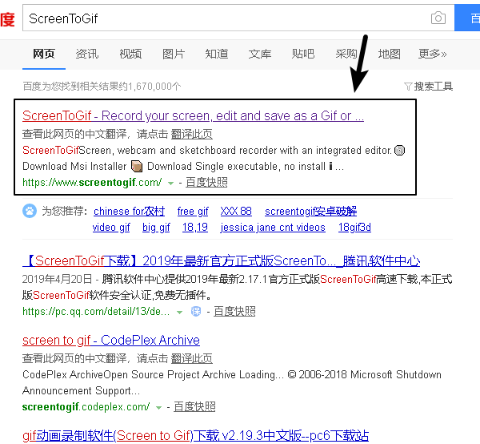

 - 打开网页，找打下载地址，下载如下内容 
 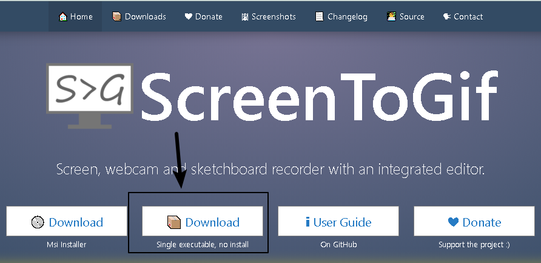

 - 解压下载的文件，放到自己想存放的位置即可 
 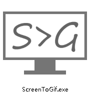

 ### 2.软件的使用
 #### 2.A 开始录制
 - 程序主界面如下 
 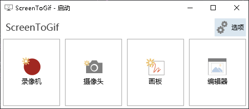

 - 点击录制按钮即可开始录制 
 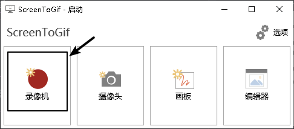
 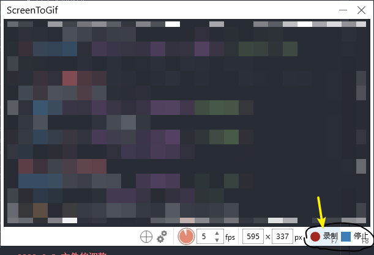
 #### 2.B 调整大小
 ##### 2.B.1 通过拖拽 `边框` 调整大小
 ##### 2.B.2 通过界面上 `+` 按钮调整大小
 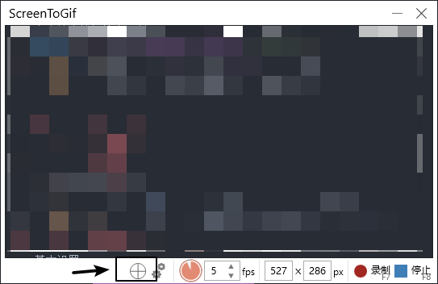
 ##### 2.B.3 通过界面上 `输入数值` 调整大小
 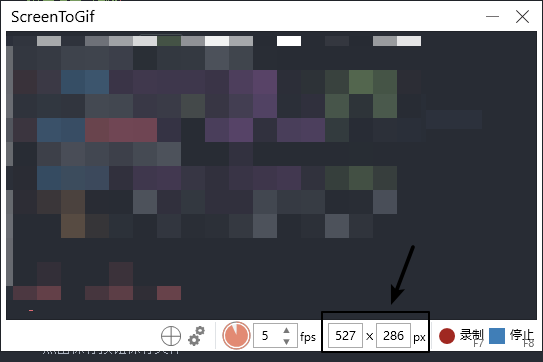
 #### 2.C 结束录制
 - 点击结束按钮结束录制 
 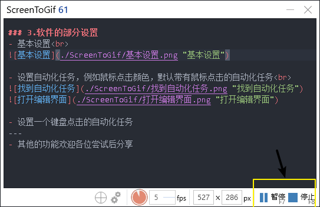
---
 - **注意：** 如果录制时间比较久，需要等待进度条结束
---

 #### 2.D 文件的调整
 - 通过菜单栏调整文件 
 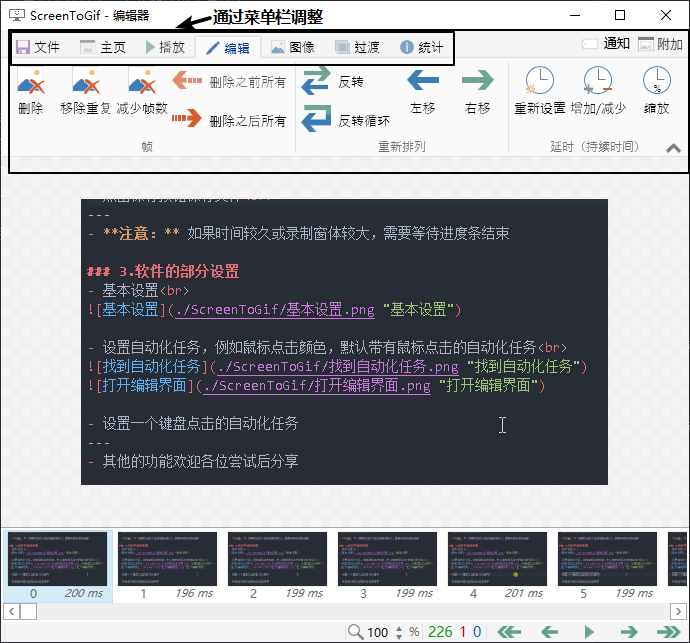
 #### 2.E 文件保存
 - 点击保存按钮保存文件 
 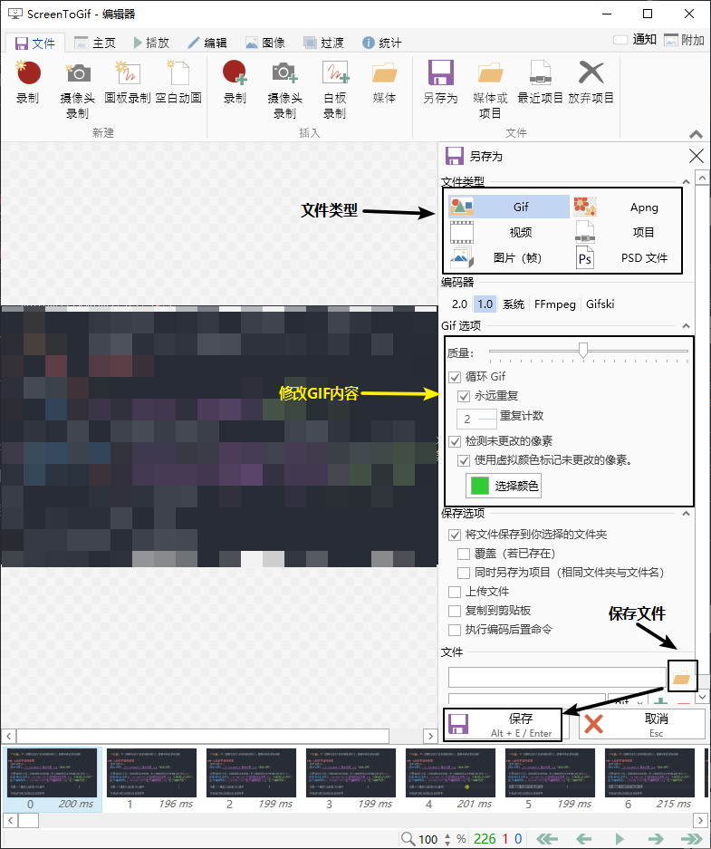
 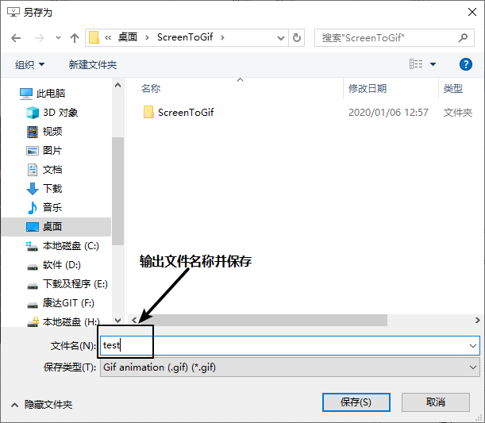
---
 - **注意：** 如果时间较久或录制窗体较大，需要等待进度条结束
---
 ### 3.软件的部分设置
 - 基本设置按钮 
 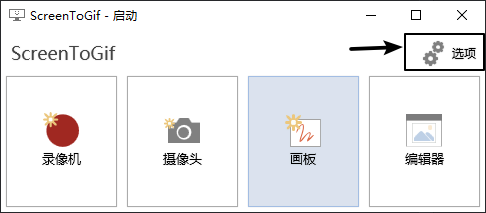
 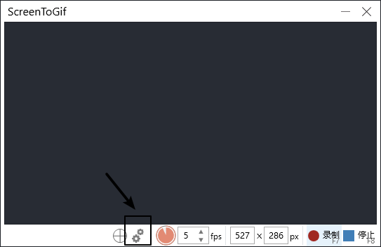
 - 基本设置界面 
 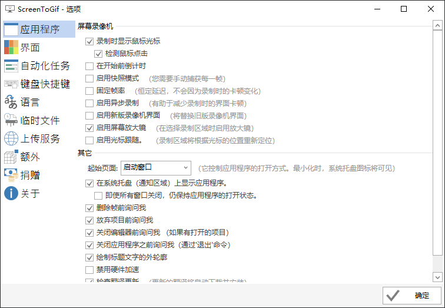

 - 设置自动化任务，例如鼠标点击颜色，默认带有鼠标点击的自动化任务
 - 自动化任务 
 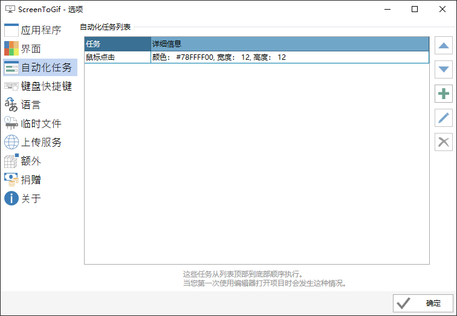
 - 打开鼠标点击编辑界面 
 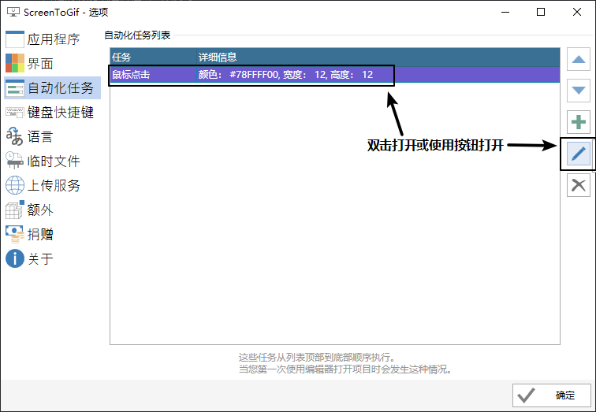

 - 设置一个键盘点击的自动化任务 
 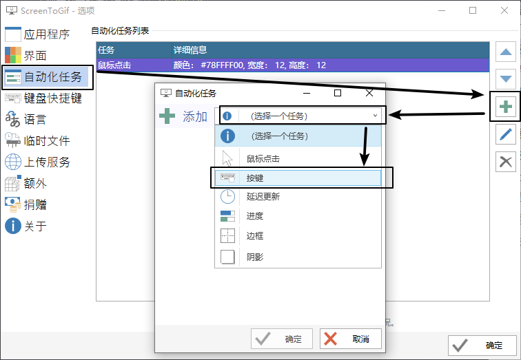
 - 修改内容后确认 
 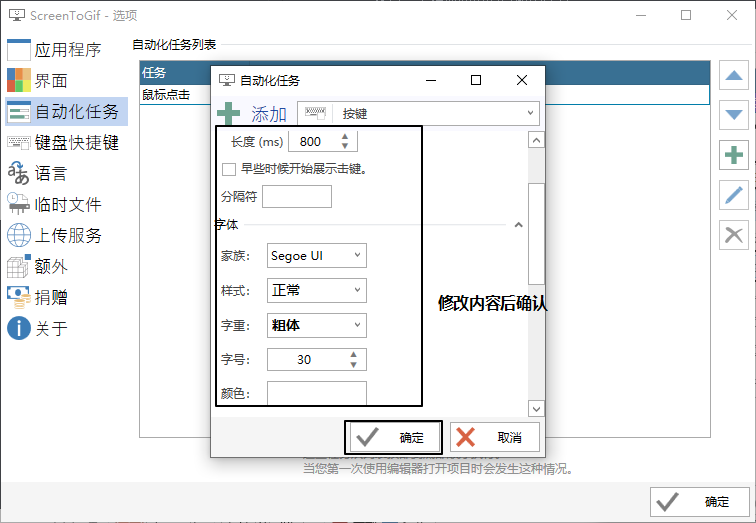
---
 - 其他的功能欢迎各位尝试后分享
 - 另外安利一款屏幕截图软件`Snipaste`
---