<!--more-->
# Windows下Office2010_2016安装及破解

## 下载office 2010

1. 将以下的地址复制到迅雷中，新建链接下载原版软件。

- **注意：**如果已经安装了软件却没有激活的，可以直接跳转到**激活软件**步骤。
- **注意：**激活软件同样可以激活**office2013、office2019、office365以及windows系统**。
- **office 2010软件**下载地址如下：

```ed2k
ed2k://|file|cn_office_professional_plus_2010_with_sp1_x86_x64_732114.iso|2939512832|7A118C7E70D022C54D27E6C3B9C72C36|/
```

- **office 2016软件**下载地址如下：

```ed2k
ed2k://|file|cn_office_professional_plus_2016_x86_x64_dvd_6969182.iso|2588266496|27EEA4FE4BB13CD0ECCDFC24167F9E01|/
```

2. 复制链接到迅雷中下载，操作方式如下(如果已经复制，在打开迅雷后迅雷会自动检测跳出下载界面)。

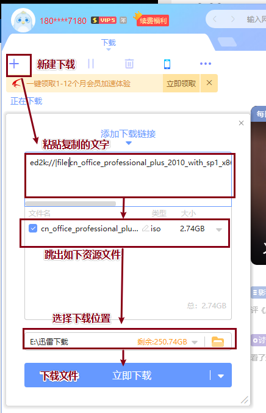

3. 下载完成后，使用压缩软件解压文件。

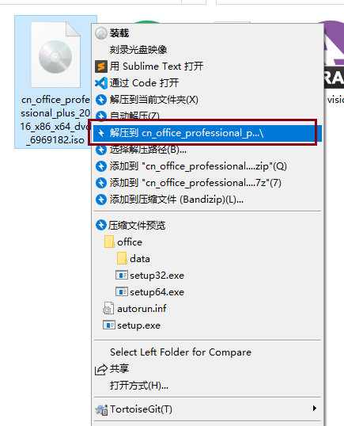

4. 在文件夹内找到`setup.exe`应用程序，点击安装`office软件`，此处以`office2016`为例，`office2010`和`2016`安装方式一样，不需要更改内容，一路安装下去即可。

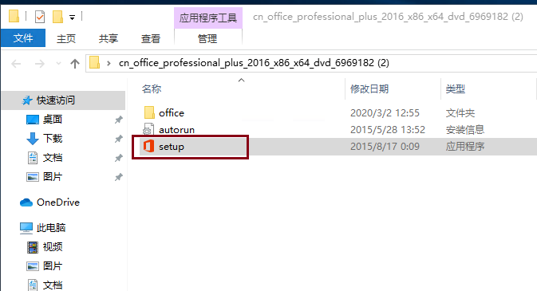

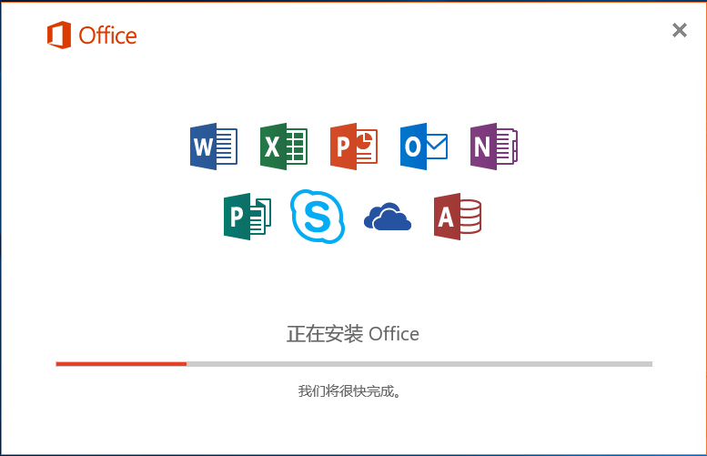

## 激活office软件

1. 点击 [此处下载](/download/KMS激活.zip)  下载激活软件，使用此软件激活程序。
2. 新建一个**文件夹**，将下载的**激活软件压缩包**拷贝到**新建的文件夹**内，文件夹名称随意，因为windows杀毒软件会识别**激活文件**为病毒，所以我们需要将此文件夹添加到windows杀毒软件的排除项中，然后再在文件夹中解压激活软件。

- **注意：**若已经关闭了windows病毒防护，则跳过以下步骤，直接解压压缩包打开激活软件即可。

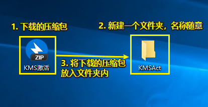

3. **`win10系统`**电脑找到左下角windows图标，**左键**点击图标，找到**设置图标**，**左键**点击设置按钮。

- **注意：**此处的设置是**win10系统**的设置，**win7系统**设置请往下看。

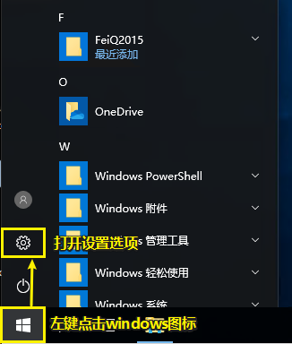


4. 找到**更新和安全**，点击打开。

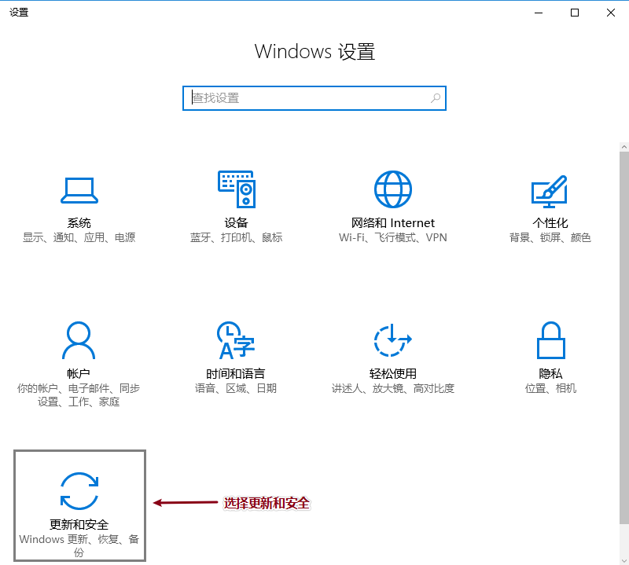

5. 选择**Windows Defender**，找到添加排除项。

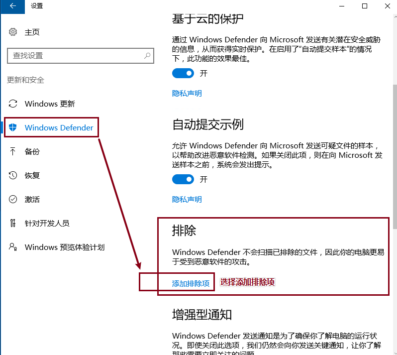

6. 添加**激活软件所在的文件夹**为排除项。

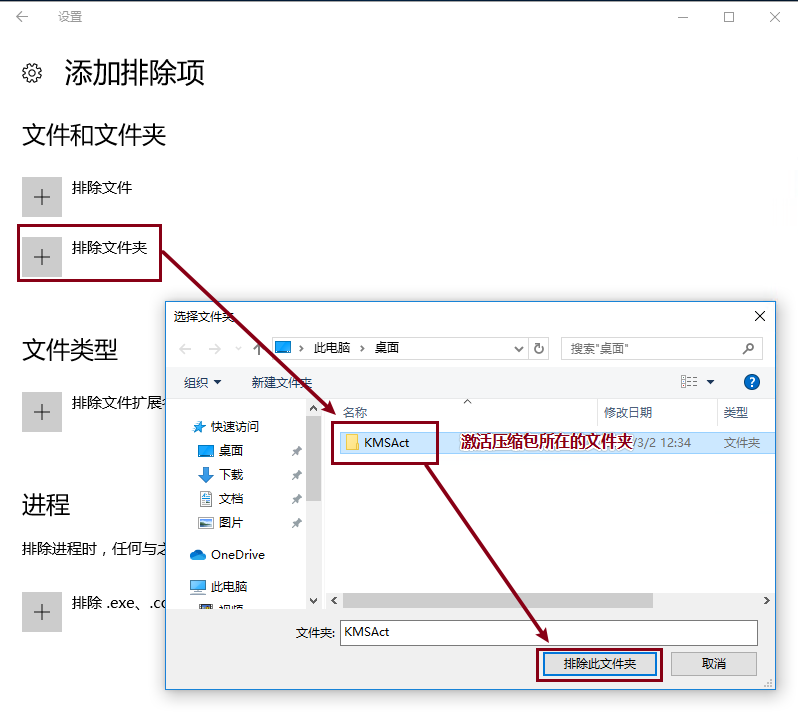

- **注意：**以下到**第7步**设置之前，是**win7系统**的设置，如果你的电脑是**win10系统**，则**直接跳过**。

- **注意：**如果你是**win7系统**，则**直接解压激活软件使用**，如果报出**病毒的错误**，再按照以下步骤设置。

  - 点击左下角的**windows图标**，选择**控制面板**选项。

  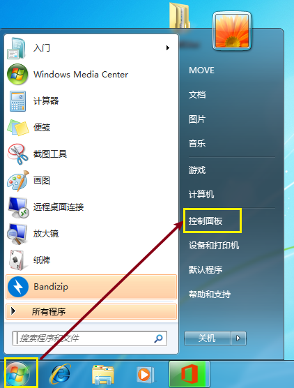

  - 将查看方式选择为**小图标**，选择**Windwos Defender**选项。

  

  - 打开窗体中**工具**按钮，选择工具和设置中的**选项**，打开选项界面。

  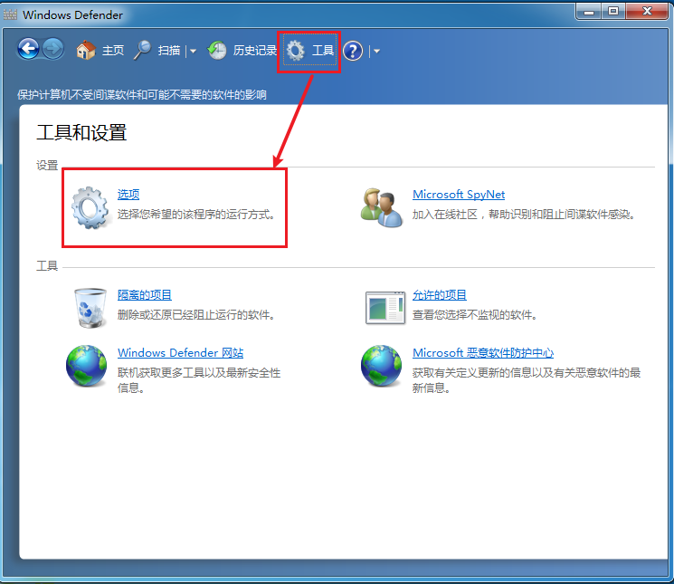

  - 选择**选项**->**排除的文件和文件夹**->**添加**按钮->选择**激活软件压缩包所在文件夹**。

  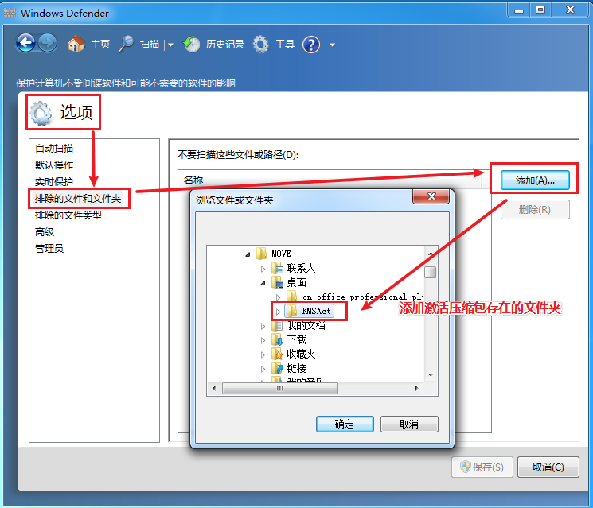

7. 添加完成后，在文件夹内解压激活软件。


8. **右键**以**管理员身份**运行激活程序。

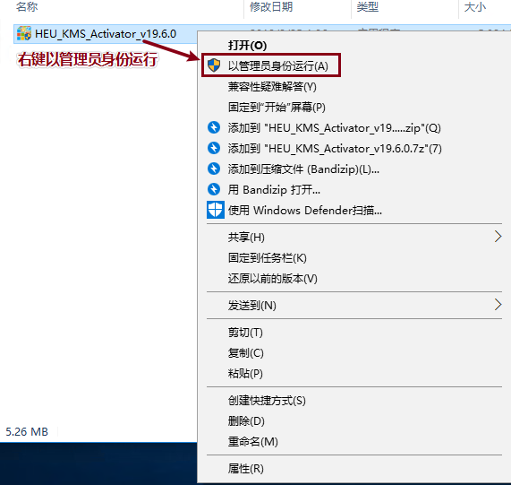

9. 在软件激活选项中，我们可以选择**选项1后再执行选项2**，或者**直接执行选项3**，完成激活office。激活完成后第一次打开软件会弹出一个输入邮箱的选项，关掉即可。


- 执行选项1后执行选项2。

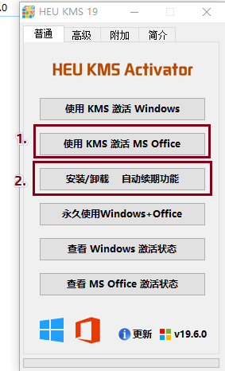

- 或者直接执行选项3。

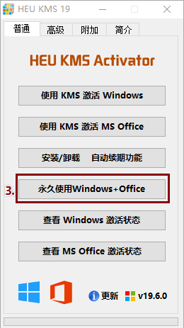

- 激活等待。

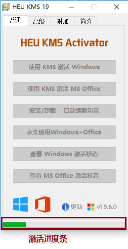

- 激活成功，到180天后会自动续期激活。

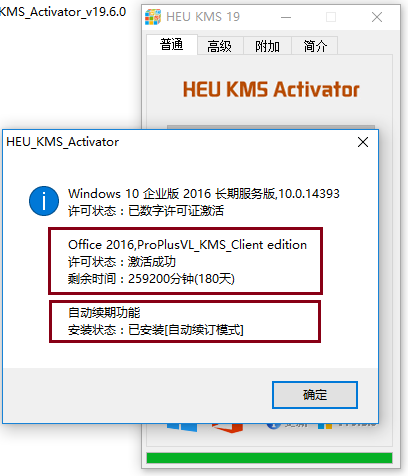

- **注意：**此激活软件同样也可以用来激活windows系统。

## 附录：下载其他版本office及windows的方法

1. 登录`MSDN`网站下载原版`Office2010`资源，`MSDN`中提供了完整的微软应用软件，包括Win7/10系统，Office全套等等，具体下载方式如下：

   - 在百度中搜索`msdn`关键字，或者直接打开 [MSDN链接](https://msdn.itellyou.cn/)：

     

   - 打开网站，找到`应用选项`:

     

   - 在网站中找到`office 2010、2016`等软件资源：

     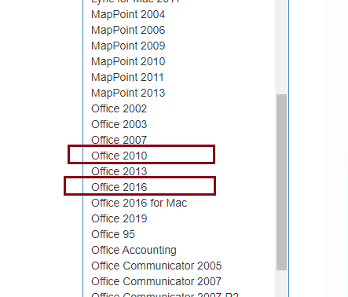

   - 在网站中找到想要安装的**office 2010、2016等**版本，此处选择的版本为`Office Professional Plus 2010 with Service Pack 1 (x86 and x64) - DVD (Chinese-Simplified)`示例：

     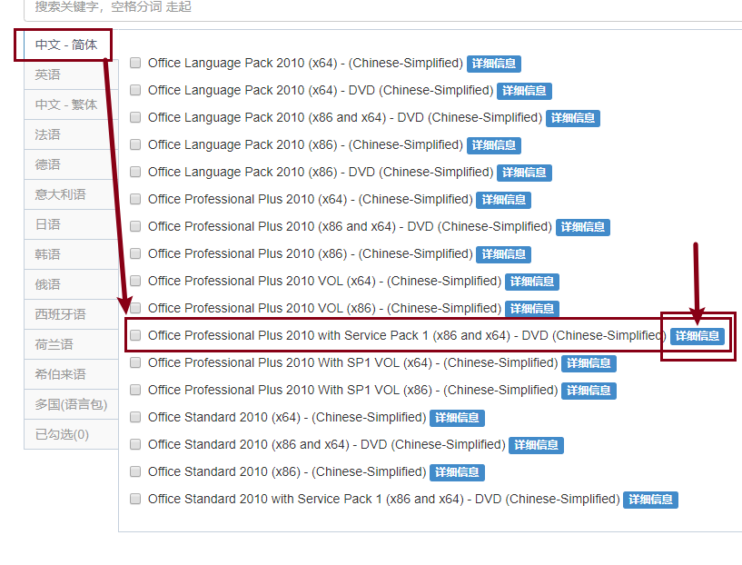

   - 打开`详细信息`，找到资源的下载地址，并将地址复制后在迅雷中新建下载：

     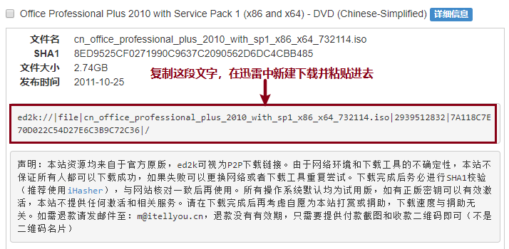

     


