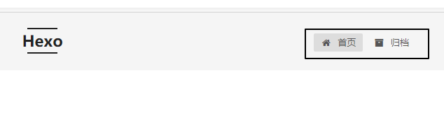
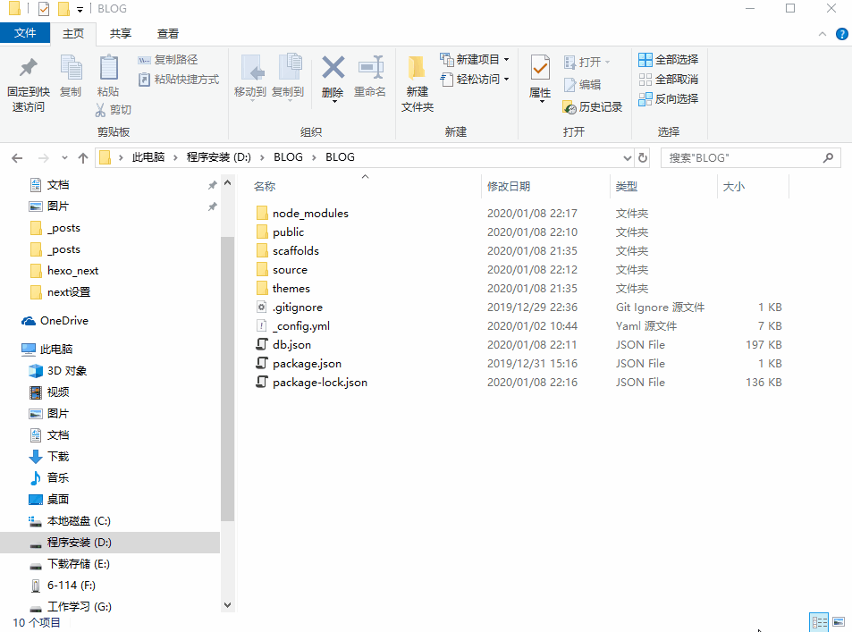
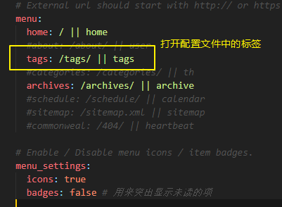
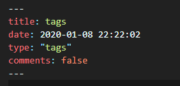

## next设置
- 访问 `http://theme-next.iissnan.com/theme-settings.html` 网站查看官网文档设置，链接如下
 [NEXT官方文档](http://theme-next.iissnan.com/theme-settings.html "NEXT官方文档")
<!--more-->
### 标签设置
- 设置博客的标签页面，默认标签页面如下
 
- next中默认打开 **首页标签** 和 **归档页标签** ，如果要打开其他的标签，需要做一定的设置，具体的设置请在文章下面查看
- 配置文件中关于标签的配置文件如下,去掉`#` 即可打开标签页，但是注意，有些标签页还需要设置一下
- 标签使用的图标是[Font Awesome图标](https://fontawesome.com/icons?d=gallery "Font Awesome图标"),有兴趣的可以到链接里查看,更改的话直接输入图标的名称就可以了
 ```
 # ---------------------------------------------------------------
 # Menu Settings
 # ---------------------------------------------------------------
 # Usage: `Key: /link/ || icon`
 # Key is the name of menu item. If the translation for this item is available, the translated text will be loaded, otherwise the Key name will  be used. Key is case-senstive.
 # Value before `||` delimiter is the target link, value after `||` delimiter is the name of Font Awesome icon.
 # When running the site in a subdirectory (e.g. yoursite.com/blog), remove the leading slash from link value (/archives -> archives).
 # External url should start with http:// or https://
 menu:                                   # 标签菜单
   home: / || home                       # 首页标签 home表示图标名称，下面同理
   #about: /about/ || user               # 关于页标签 
   #tags: /tags/ || tags                 # 标签页标签
   #categories: /categories/ || th       # 分类页标签
   archives: /archives/ || archive       # 归档页标签
   #schedule: /schedule/ || calendar     # 日历页标签
   #sitemap: /sitemap.xml || sitemap     # 站点地图页便签
   #commonweal: /404/ || heartbeat       # 公益404页标签
 # Enable / Disable menu icons / item badges.
 menu_settings:
   icons: true #使用图标
   badges: false # 用来突出显示未读的项
 ```
 
- 如果要显示各标签中文显示的翻译，需要在`Next`主题下的`languages/zh-Hans.yml`中修改，同理，其他语言修改自身语言的内容

 

- 文件内容如下
 ```
 agc
 ```
#### 添加标签页页面
- 在博客目录下打开`git bash`，使用下列命令创建一个标签的markdown文件
 

- 打开 **主题配置文件** ，在菜单配置中打开tags标签<br>


- 如果我们的博客添加了评论，在tags标签中不想显示评论内容，那我们需要关闭它
- 打开 **source** 文件夹下 **_posts** 文件夹内 **tags** 文件夹下 **index.md** 文件， 关闭tags标签的评论
 ```
 ---
 title: tags
 date: 2020-01-08 22:22:02
 type: "tags"
 comments: false
 ---
 ```



#### 设置首页文章显示的文字个数
- 在配置文件下搜索`auto_excerpt`找到，修改是否设置首页不显示完全，以及显示的字体个数
