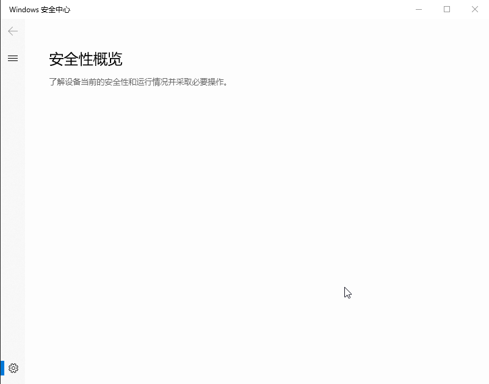
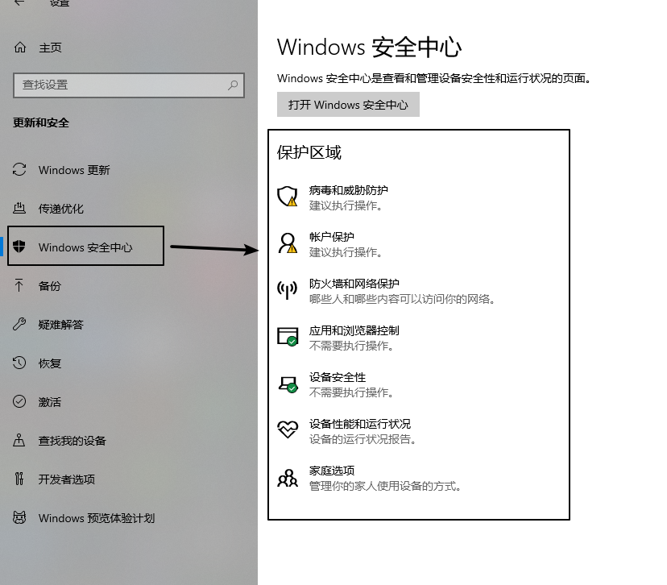
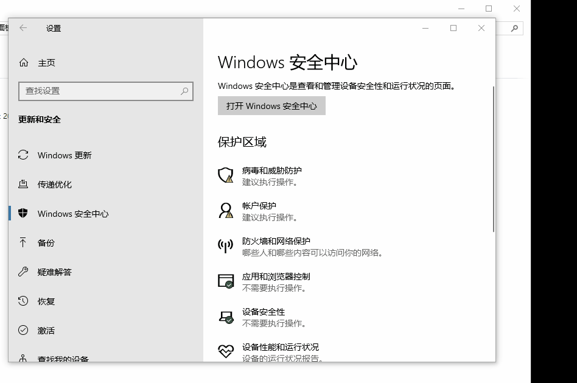
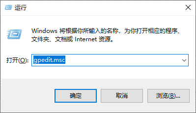
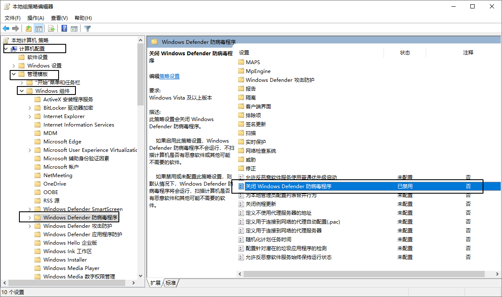
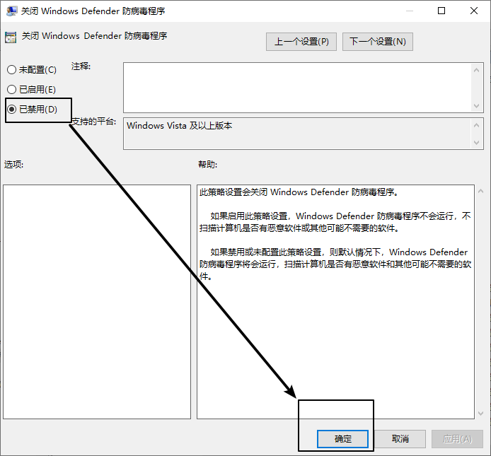
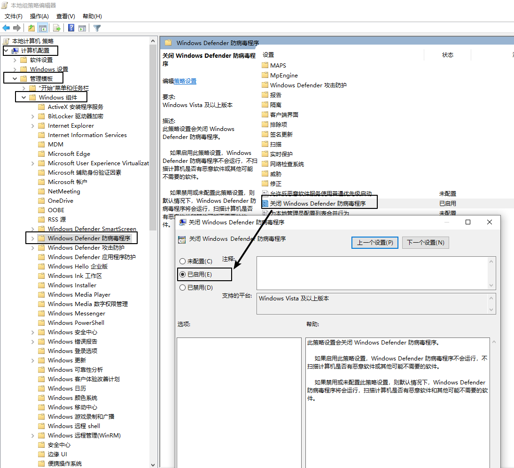

 

<!--more-->

## Windows10安全性概览空白

- 今天下载文件一直被检测病毒，想关掉windows自带的病毒软件
- 进入到系统设置中找到windows安全中心发现安全性概览界面内容空白，如下图所示<br>


- 正常来讲应该是这个样子的<br>

- 解决办法
- 复制以下代码，放到txt文档中，将txt的扩展名`.txt`改为`.reg`,然后双击运行，**重启计算机** 即可解决问题

```
Windows Registry Editor Version 5.00
[HKEY_LOCAL_MACHINE\SOFTWARE\Policies\Microsoft\Windows Defender]
"DisableAntiSpyware"=dword:00000000
[HKEY_LOCAL_MACHINE\SOFTWARE\Policies\Microsoft\Windows Defender\Real-Time Protection]
"DisableBehaviorMonitoring"=dword:00000000
"DisableIOAVProtection"=dword:00000000
"DisableOnAccessProtection"=dword:00000000
"DisableRealtimeMonitoring"=dword:00000000
[HKEY_LOCAL_MACHINE\SYSTEM\CurrentControlSet\Services\SecurityHealthService]
"Start"=dword:00000002
```

## 实时保护无法关闭
- 解决完这个问题之后，正常来讲应该会显示出来
- 如果想关闭实时保护（比如使用kms激活系统，实时保护会判断它是病毒），还会出现需要管理员权限的情况（实时保护由管理员管理），如下图<br>


- 解决办法如下<br>
- 按下键盘的`win + R` 键 输入`gpedit.msc`,打开本地策略编辑器<br>

- 在本地策略编辑器下，在左侧界面找到`计算机配置` 下 `管理模板` 下 `Windows组件` 下 `Windows Defender防病毒程序`，在右侧找到`关闭Windows Defender防病毒程序` <br>

- 然后先 **禁用** 此项<br>

- 再 **启用** 此项即可<br>
