<!--more-->

# 实验1第一题-文件操作

## 实验素材

- 实验素材下载链接：[下载链接](/download/实验1第一题素材.docx)

## 实验题目

- 实验题目下载链接：[下载链接](/download/实验1第一题题目.docx)

## 实验参考

### 题目1：页边距

`设置上下页边距为2.5cm，左右页边距为2cm，页眉页脚边距为2cm，每页48行，每行50个字符，并添加水印文字为“样本”； `

- 在**布局**选项卡中，如图打开**页眉设置选项**，分别设置**页边距**、**布局**、**文档网络**。

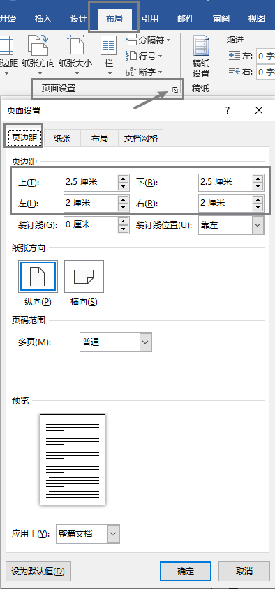

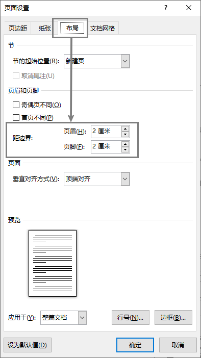

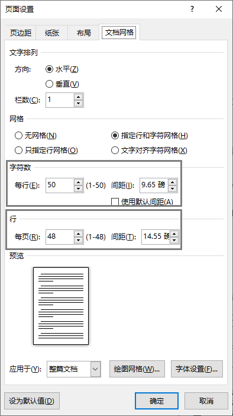

- 在设计选项卡中，选择**水印**选项，选择**自定义水印**，添加**文字**水印。

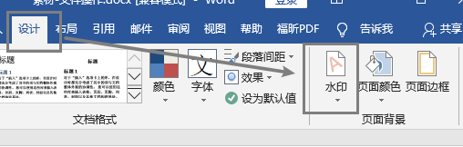

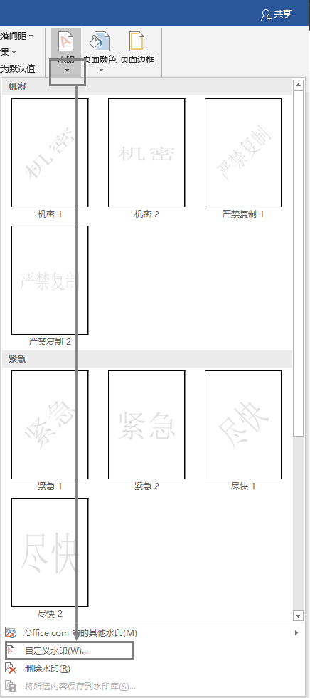

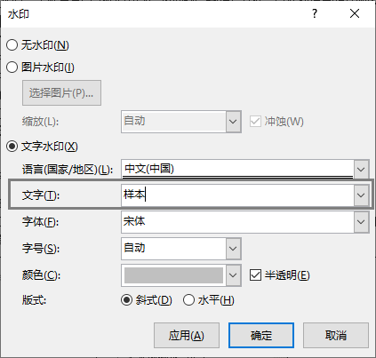

### 第二题：设置样式

`设置样式：将文档中“第13章 文件操作”设置为“标题1”样式，“13.1 保存文件”等二级标题设置为“标题2”样式，“13.1.1 第一次保存工作簿”等三级标题设置为“标题3”样式；`

- 选中标题，在**开始**选项卡中，选择应用**标题1**。

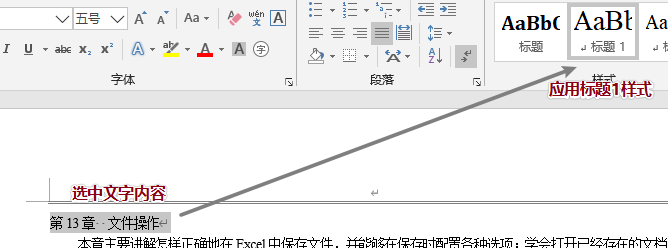

- 选中二级标题，在**开始**选项卡中，选择应用**标题2**，对于所有二级标题，要逐个应用。

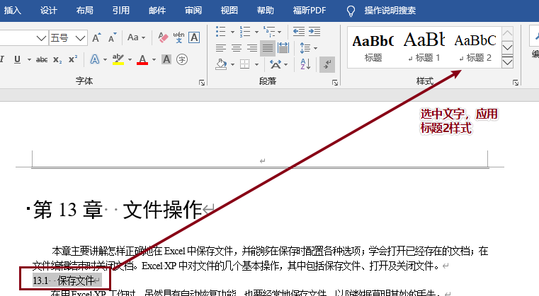

- 选中三级标题，在**开始**选项卡中，选择应用**标题3**，对于所有三级标题，要逐个应用。

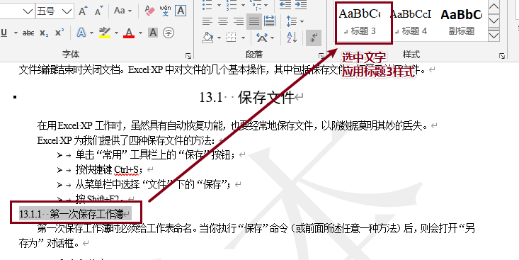

### 第三题: 题注

`为文档中所有图片插入题注，新建标签为“图”，并设置所有图片与题注居中显示；`

- 选中图片，选择**右键**插入题注，或者在**引用**选项卡中，找到**插入题注**。

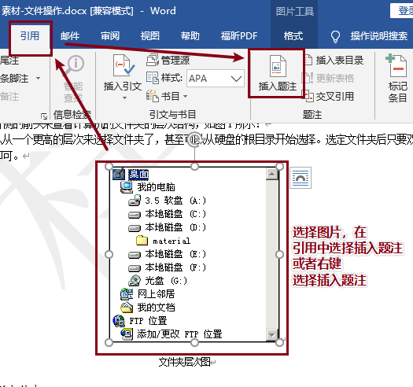

- 选择新建标签，标签文字选择**图**。

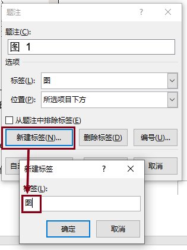

- 使用**DEL键**删除多余的**回车符**，将题注和文字调整为一行。

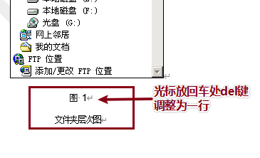

#### 题目4：图表目录

`在文档开头处建立图表目录，目录格式为正式、显示页码、页码右对齐，在生成的目录后插入分页符，将目录与正文分开；`

- 将光标放置整个文档的开头处，选择**引用**选项卡下的**目录**选项，选择自定义目录。

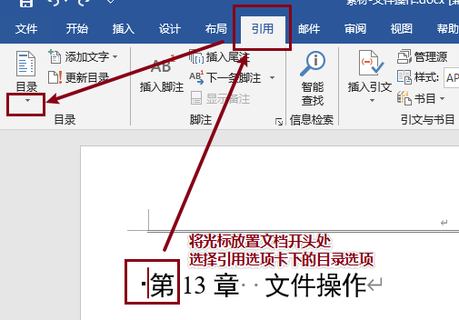

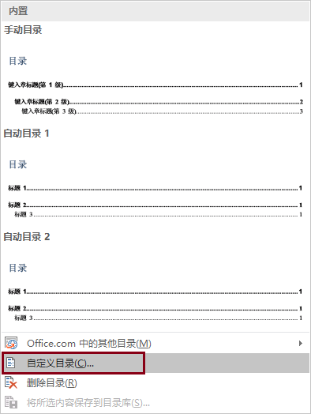

- 调整目录样式，因为题目要求目录只按照题注显示，所以此处的**显示级别**设置为1。在**选项**中将**目录建自**选择为**题注**，删除其他内容，只保留题注，并设置**目录级别**为**1**。

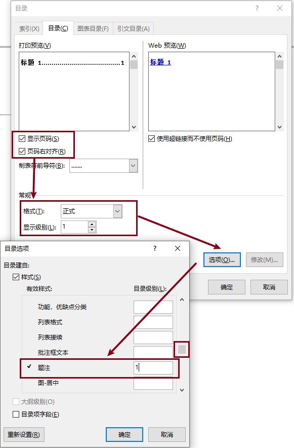

- 将光标设置到文章的开头处，选择**布局**选项卡中的**分隔符**选项，添加**下一页分节符**，**注意此处选择的不是分页符**。

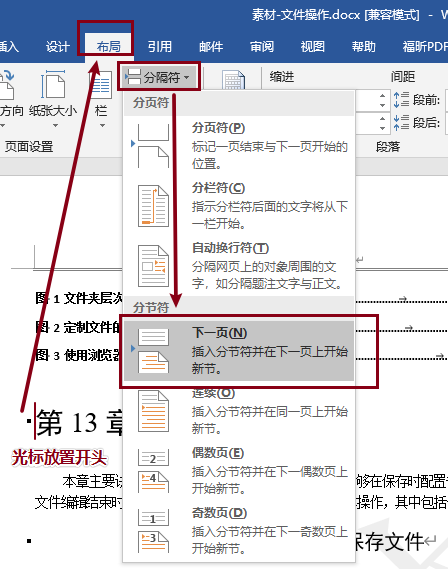

- 在**开始**选项卡中，打开**显示所有编辑标识**，查看分节符是否插入成功。

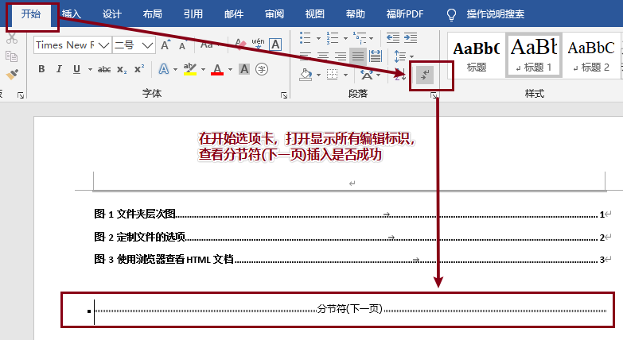

### 题目5：页眉页脚

- 将页眉设置为编辑状态，在**设计**选项卡中，关闭**链接到前一节**，并选择**文档部件**中的**域**选项，进入域选项编辑。

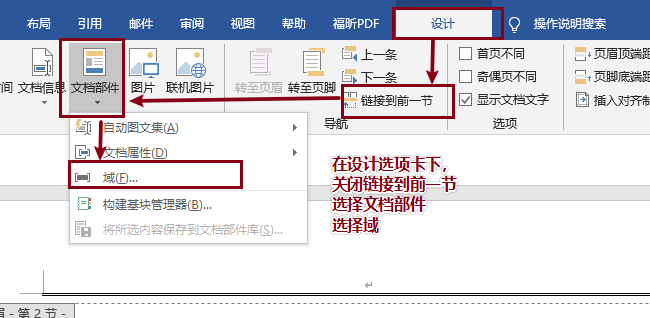

- 将域选项**类别**选择**链接和引用**，**域名**选择**StyleRef**，**样式名**选择**标题1**，确定添加，完成页眉编辑。

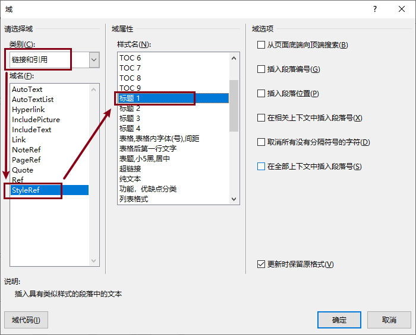

- 进入页脚编辑状态，在**设计**选项卡中**关闭链接到前一节**，选择**页码**选项卡，选择**页面底端**，选择**普通数字2**，完成页脚的编辑。

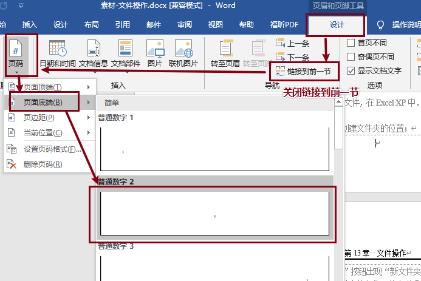

- 调整页脚，使用**DEL键**删除页脚中多余的换行符。

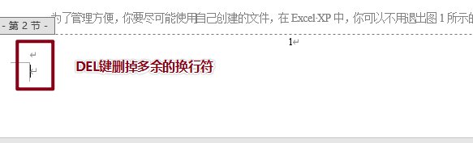

## 结果参考

- 实验完成后的基本效果如下：

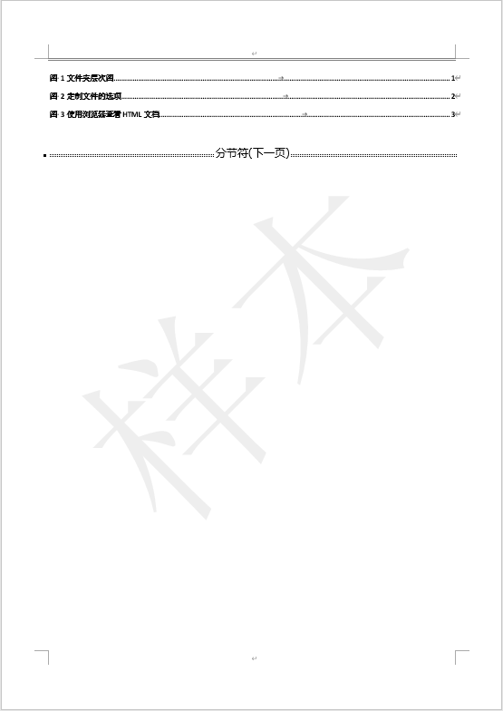

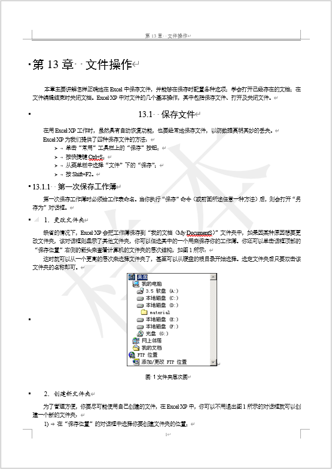

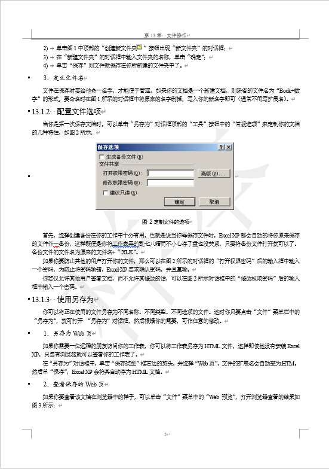

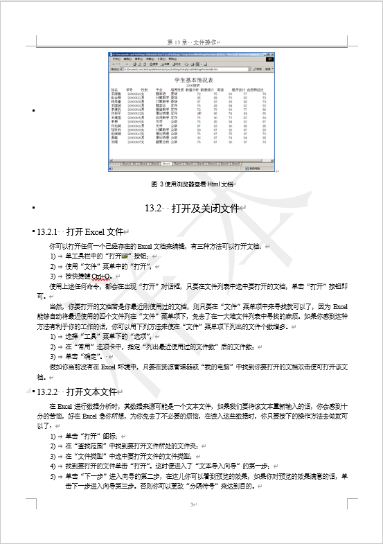

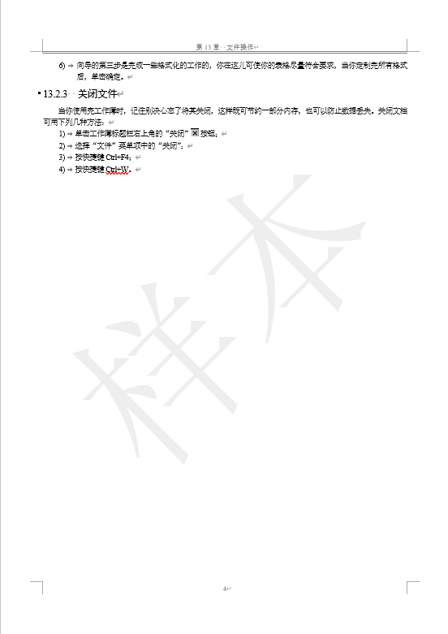