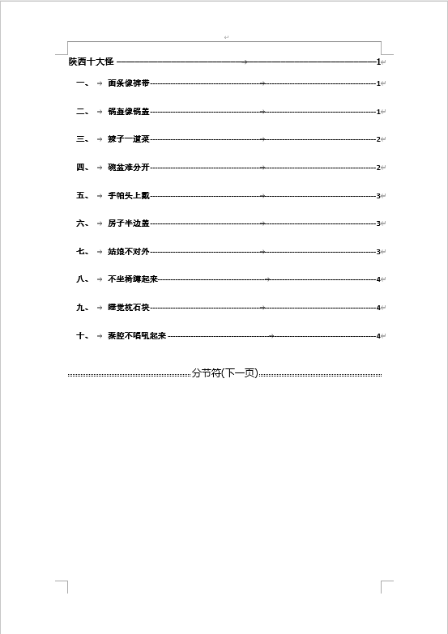

<!--more-->
# 实验1第三题-陕西十大怪

## 实验素材

- 实验素材下载链接：[下载链接](/download/实验1第三题素材.docx)

## 实验内容

- 实验题目下载链接：[下载链接](/download/实验1第三题题目.docx)

## 实验参考

### 第一题：替换功能

`运用替换功能将每一怪中歌谣和解说自然分段（提示：将全角省略符替换为段落标记）；`

- 观察文章特征，发现**解说**两字前面有"..."符号，此符号为**全角省略号**，所以我们只需要将**全角省略号**替换为**段落标记**（即换行符）即可。

- 在**开始**->**编辑**下找到**替换工具**，打开**替换选项卡**，打开底部**更多选项**，将**查找内容**选择为底部**特殊标记**中的**全角省略号**，将**替换内容**选择为底部**特殊标记**中的**段落标记**，选择**全部替换**完成替换。

### 第二题：新建节样式并应用

`新建样式“节标题”：字体为黑体、小三号，段落间距为段前10磅、段后自动、1.5倍行距，编号样式为“一、二、……”，将该样式应用于正文中的十大怪标题中；`

- 在**开始选项卡**下，选择样式**下拉按钮**，进行**创建样式**。
- 输入**节标题**，点击**修改**按钮。
- 在样式选项卡底部的**格式**选项中，进行**字体**、**段落**、**编号**的设置。

- 字体设置选项如下。

- 段落设置选项如下。

- 编号的设置选项如下。

- 设置完成后，在**样式**中会出现**节标题**样式，我们将文章中的**每一个二级标题**，选中后应用**节标题样式**。

### 第三题：插入封面

`为文档插入“瓷砖型”封面，设置标题为“陕西十大怪歌谣解说”，副标题为“节选自百度百科”，年份插入当前日期（可根据系统时间自动更新），删去其他多余文字内容；`

- 将**光标**放到文章**开头处**，在**插入**选项卡中打开**封面**选项，题目中要求选择**青花瓷封面**，在本人的**word2016版本**中未找到**青花瓷封面**，所以此处使用**花丝**封面替换。

- 修改**文档标题**、**文档副标题**、**日期**以及删除**多余的信息**。

- 对于日期格式的更改，我们需要**选中日期**内容，在**插入**选项卡中选择**文档部件**，选择**域**，弹出域选项卡。

- 进行如下设置，将日期格式只设置年份，格式为`yyyy`。

- 设置完成后，删除日期后的**日**与**月**。

### 第四题：插入目录

`在封面和正文之间插入“优雅型”目录，制表符前导符为短横线“-------”。所有目录文字设置为宋体、加粗，段落间距为2倍行距；在目录后插入分隔符，将目录和正文分页；`

- **注意:** 题目中未说明需要将标题设置为**标题1样式**，但我们需要将此处的**标题**设置为**标题1样式**。

- 将**光标**放置**文章开头处**，在**引用选项卡**中打开**目录**选项，选择**自定义目录**。

- 设置**制表符前导符**，**格式**，**显示级别**，进入**选项**设置界面。
- **注意:** 因为目录中包含了"陕西十大怪"**大标题**和下面的**小标题**，所以此处要显示**2**个级别的标题。

- 在目录选项中，将**标题1**设置为**1**级目录，将**节标题**设置为**2**级目录，完成目录创建。

- 将**光标**放置在**文章开头处**，在**布局**选项卡中，点击**分隔符**选项，选择**分节符**的**下一页**分节符。

- 插入完成后，我们可以在**开始**选项卡中，打开**显示编辑标识**选项，查看分节符是否插入成功。

### 第五题：插入尾注

`在正文最后一段的“富有生活情趣的题材。”文字后添加尾注，输入“该文档共X页，共Y字符数。”（提示：X使用NumPages域，Y使用NumWords域）。`

- 将**光标**定位到**结尾处**，在**引用**选项卡下选择**插入尾注**选项。输入**除域内容外**的其他内容。

- 在需要插入域内容的地方，找到**插入选项卡**下的**文档部件**选项，选择**域**，进入域编辑界面。

- 进行文档页数域设置，设置格式如下。

- 进行字符数域设置，设置格式如下。

## 结果参考

