<!--more-->
# 实验1第二题- 印章管理办法

## 实验素材

- 实验素材下载链接：[下载链接](/download/实验1第二题素材.docx)

## 实验题目

- 实验题目下载链接：[下载链接](/download/实验1第二题题目.docx)

## 实验参考

### 题目1：替换

`运用替换功能对除标题“印章管理办法”以外的正文文字自然分段（每个制表符替换为一个段落标记）；`

- 在开始中找到替换选项。

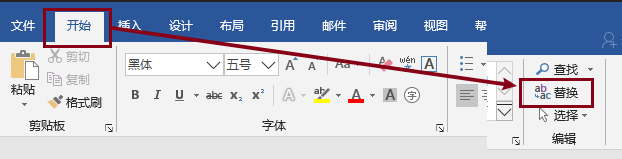

- 打开替换选项卡更多选项。

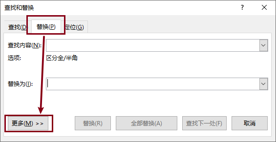

- 选择特殊格式选项，将查找内容选择为**制表符**，将替换内容选择为**段落标记**。

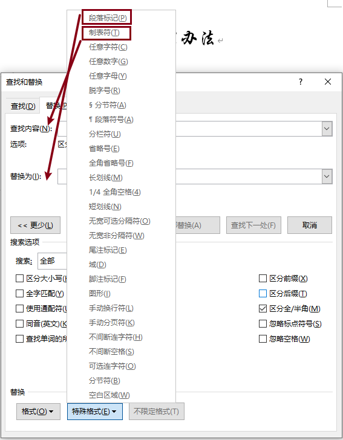

- 应用**全部替换**完成替换。

### 题目2：标题2样式

`修改“标题2”样式：字体为微软雅黑、三号、常规，段间距为1.5倍行距，段前、后均为0.5行，居中对齐，将所有章的标题应用该样式；`

- 在**开始**选项卡中找到**标题2样式**。

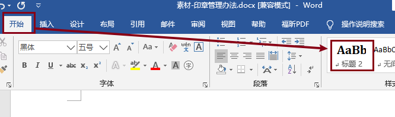

- 在**标题2样式**上右键选择修改。

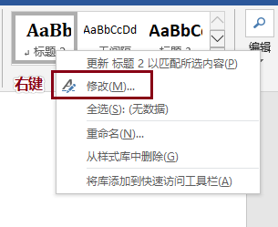

- 选择底部格式选项中选择字体选项，并修改字体。

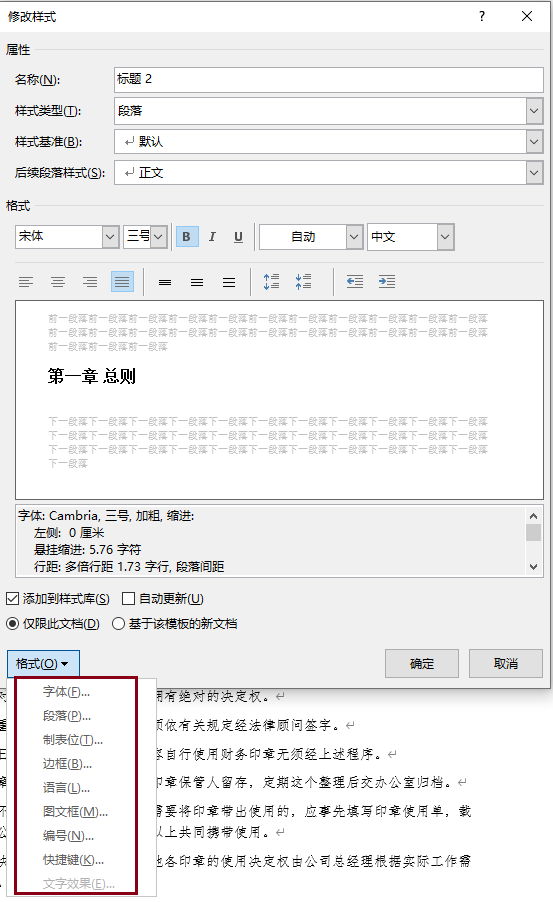

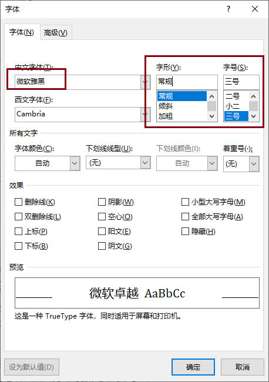

- 在格式中选择段落，调整段落格式。

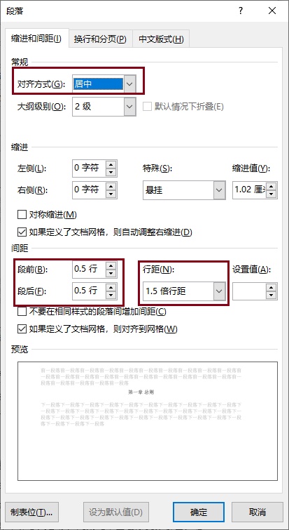

- 将文章中**所有标题**逐个应用标题2样式。

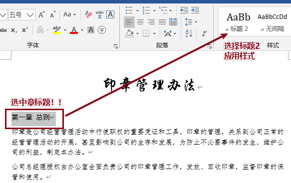

### 题目3：创建节标题

`新建并应用“节标题”样式：字体为仿宋、小四号、常规，段间距为1.5倍行距，段前、段后均为0行，悬挂缩进5字符，设置编号格式为“第X条”，其中编号样式为“一、二、三（简）……”，将各章的标题下文字应用该样式；`

- 找到样式旁的下拉按钮，选择创建样式。

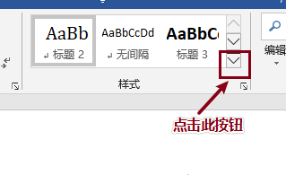

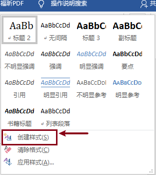

- 输入名称`节标题`，选择修改按钮。

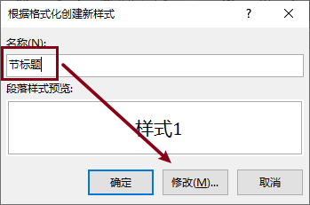

- 在样式编辑页面选择格式选项卡，分别编辑**字体**、**段落**、**编号**。

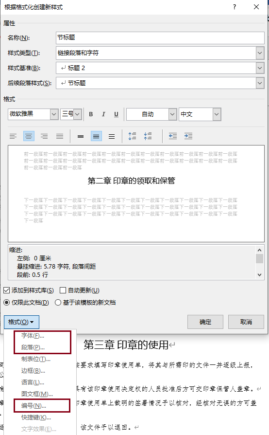

- 在格式选项卡中选择字体，修改字体选项。

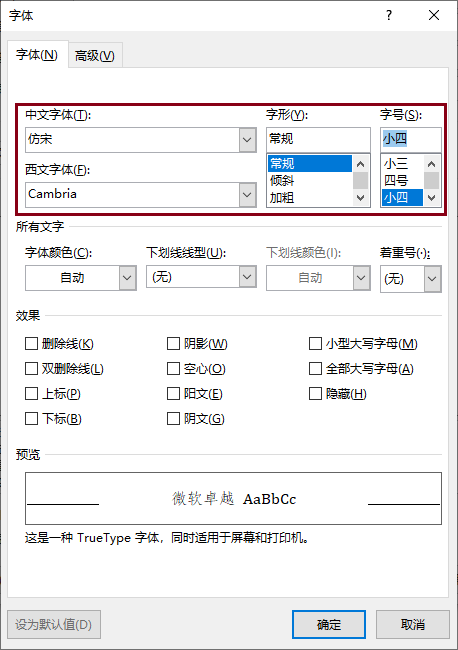

- 在格式选项卡选择段落，修改段落选项。

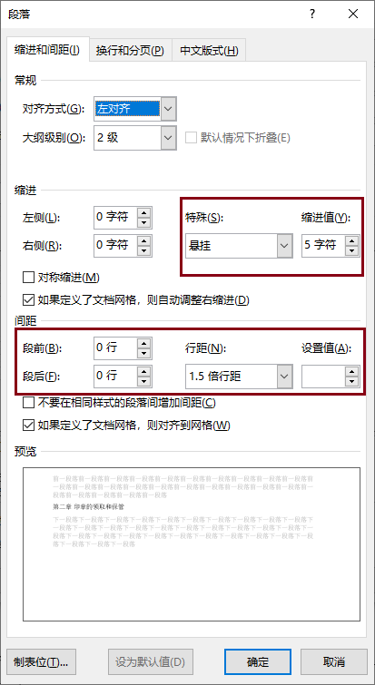

- 在格式选项卡选择编号，修改编号选项。

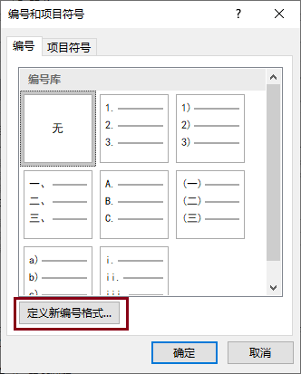

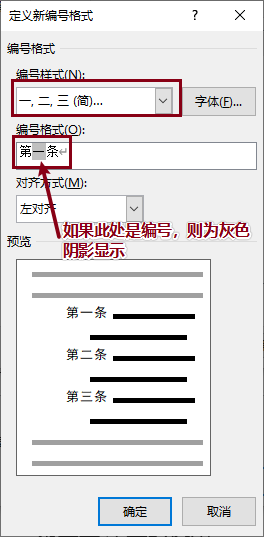

- 将文章的所有正文应用节标题样式。

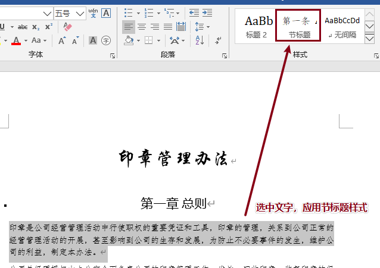

### 题目4：添加目录

`在标题“印章管理办法”下建立目录，目录建自“标题2”样式，页码右对齐，制表符前导符样式为“……”，并在生成的目录后插入“下一页”分节符，将目录与正文分开；`

- 首先将光标定位到标题后，选择引用选项卡，打开目录选项，选择自定义目录。

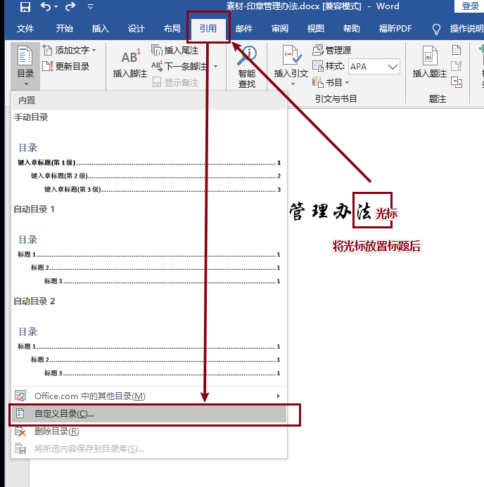

- 进行如下设置。
- 注意：因为文章不要求小目录，只显示**标题2样式**目录，所以此处的显示级别设置为1。
- 注意：在选项中只选择标题2，并设置级别为1。

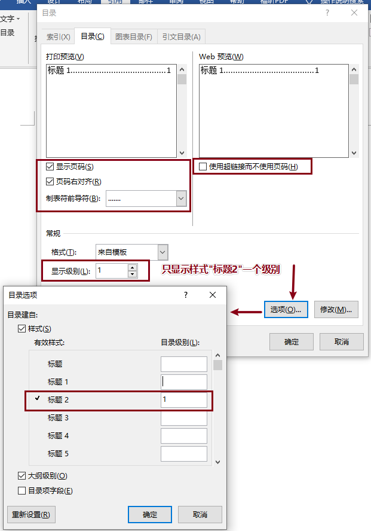

- 将光标放在目录底部换行符处，在**布局**中选择**分隔符**，选择**分节符-下一页**插入。

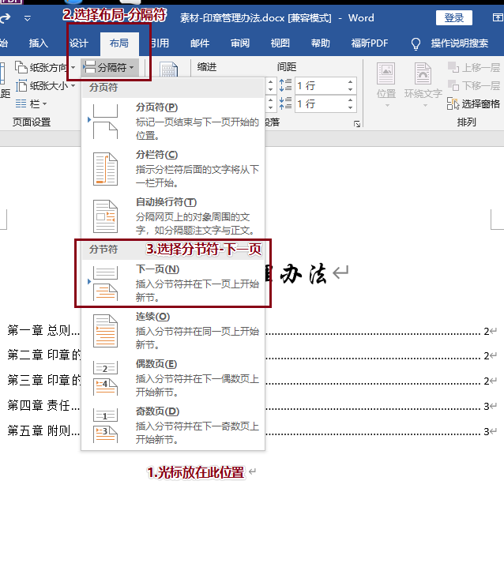

- 在多出页面的换行处插入光标，使用键盘的**del**键删除空白页。

- 注意：我们可以选择打开所有编辑标识，查看分节符是否插入成功。
- 在开始选项卡下打开显示所有编辑标识。

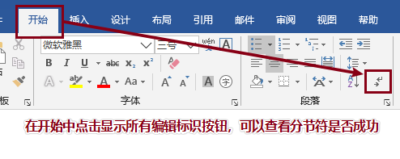

- 在word页面中查看分节符是否插入成功。

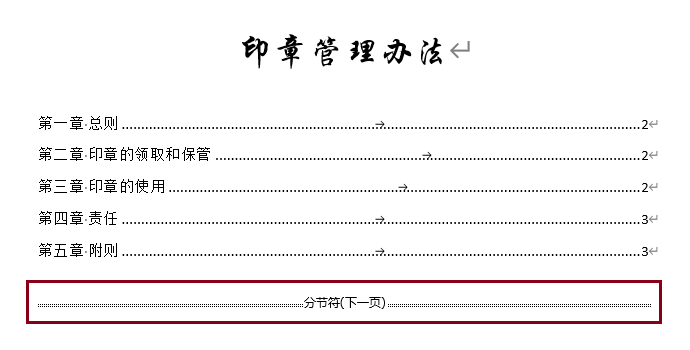

### 题目5：页眉页脚

`设置页眉页脚：文档目录页无页眉页脚；其余页面的页眉使用StyleRef域设置对“标题2”的引用（即页眉可随章标题自动变化），插入“页面底端”的页码、页码格式为“普通数字2”，起始页码为1。`

- 在要插入页眉处，**双击鼠标左键**进入页眉编辑状态。

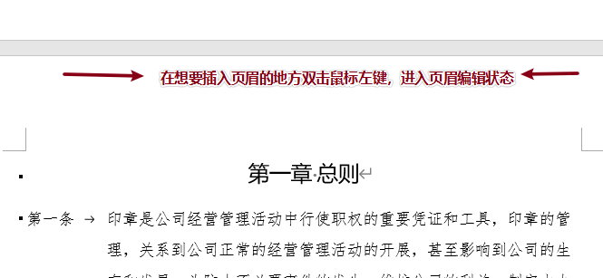

- 将光标放置页眉处，进入页眉编辑状态。在页眉编辑选项卡中，取消**链接到前一节**，选择**文档部件**，选择**域**，弹出**域**编辑选项卡。
- 在域编辑选项卡中，选择**链接和引用**类别，选择**StyleRef**域名，选择**标题2**样式名，完成页眉插入。

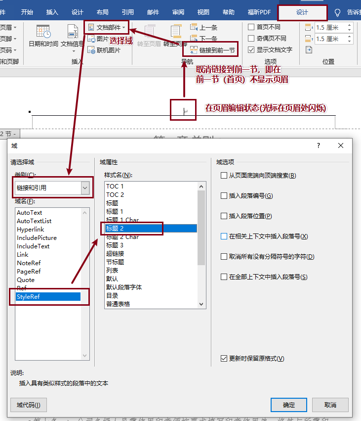

- 在需要插入页脚的位置，双击鼠标左键，进入编辑页脚状态。
- 在页脚编辑状态下，取消**链接到前一节**，选择**页码**->**页面底端**->**普通数字2**样式。

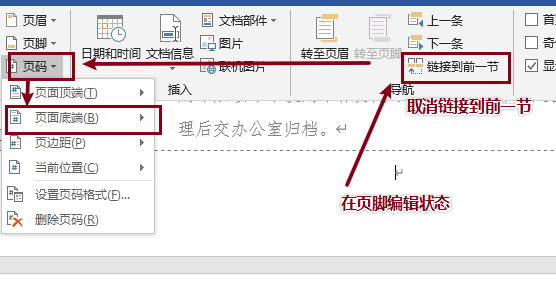

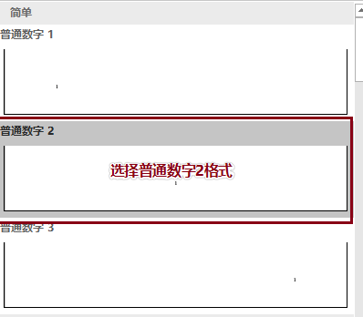

- 在页码选项中，选择设置页码格式，将页码起始数字设置为1。

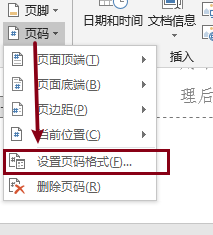

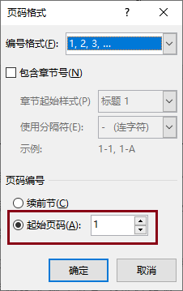

## 结果参考：

- 实验效果参考如下：

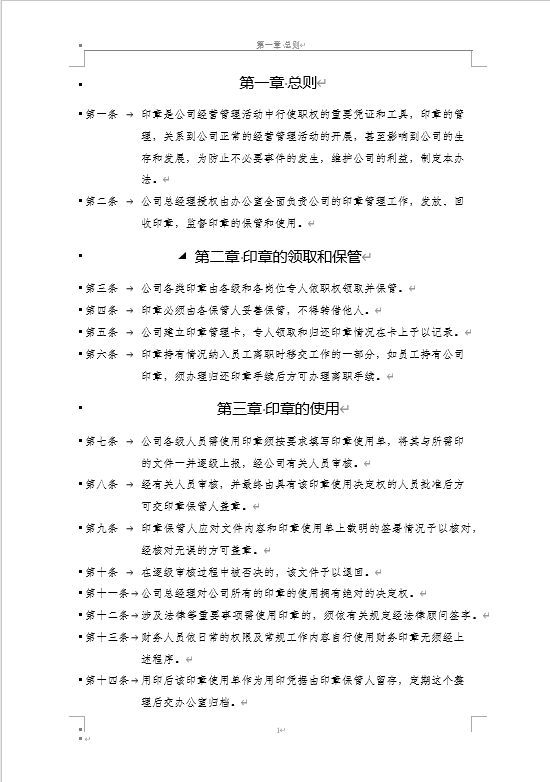

