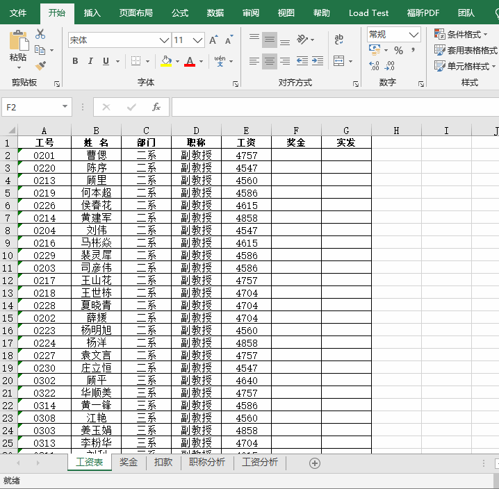
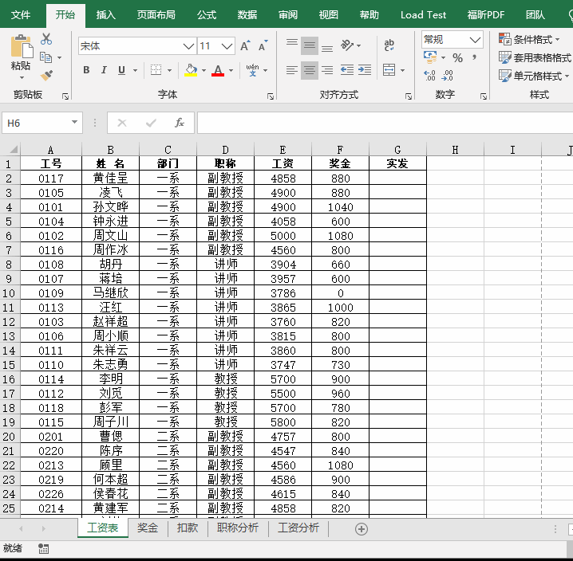
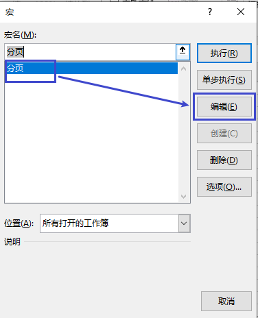
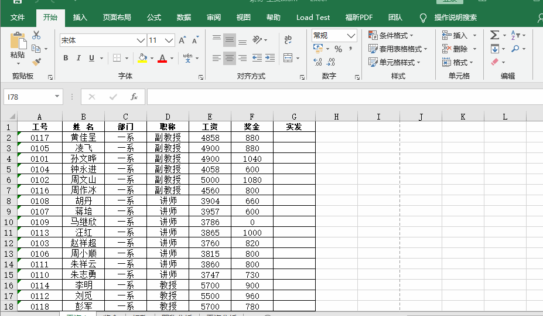

# 实验2第1题-工资

## 使用知识介绍

EXCEL中进阶重点为四大函数、数据透视图、宏命令，四大分别是**IF函数**、**VLOOKUP函数**、**SUMIF函数**、**COUNTIF函数**。掌握了他们基本可以搞定EXCEL中90%的问题，此次实验使用了**IF函数、VLOOKUP函数、COUNTIF函数、宏命令**。

## 实验素材

- 实验素材下载链接：

 

## 实验题目

- 实验题目下载链接：

 

## 实验参考

### 题目1：计算奖金

`在工作表“奖金”的E列，利用公式计算奖金（奖金=工作量*20，但若违纪奖金为零）`

- 在打开文档时会询问是否启用宏，在此我们需要**启用宏内容**。


- 使用**IF函数**计算奖金示例。


### 题目2：合并奖金到工资表

`利用VLOOKUP函数，将“奖金”合并到工作表“工资表”的对应列`

- 使用**VLOOKUP函数**合并奖金示例。



### 题目3：统计人数

`根据工作表“工资表”数据，在工作表“职称分析”中，利用COUNTIF函数统计每类职称人数`

- 使用**COUNTIF函数**做统计示例。


### 题目4：排序

`在工作表“工资表”中，按“部门”升序`

- 自定义排序示例。



### 题目5：补全宏命令

`在模块1的“分页()”中，填充代码实现在工作表“工资表”中，自动插入分页符，使得每部门职工强制分页`

1. 找到宏命令并查看。

   

2. 找到对应的宏并编辑。

   

3. 完整的宏命令格式如下：

```vb
Sub 分页()
 Sheet1.Activate
 部门 = Sheet1.Cells(2, 3)
 For i = 2 To 106
   If 部门 <> Sheet1.Cells(i, 3) Then                         '填充此行
     部门 = Sheet1.Cells(i, 3)
     Sheet1.Rows(i).Select
     ActiveWindow.SelectedSheets.HPageBreaks.Add Before:=ActiveCell
   End If
 Next
End Sub

```

- 补全宏示例：


### 题目6：执行宏

`执行“分页()”过程，在工作表“工资表”中插入分页符`

- 执行宏示例。


- 执行完成后使用打印查看分页效果。

