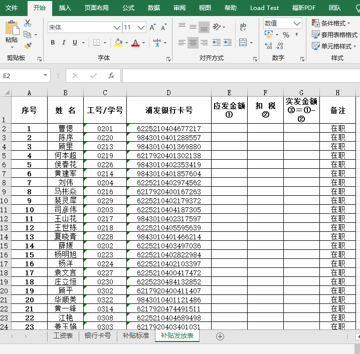
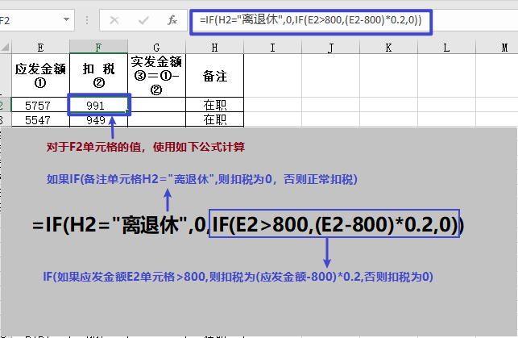
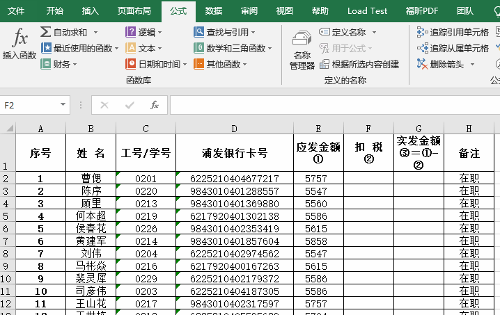
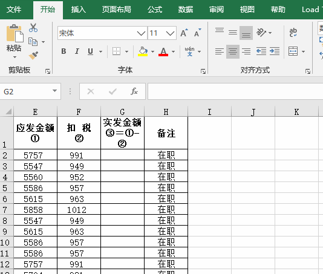
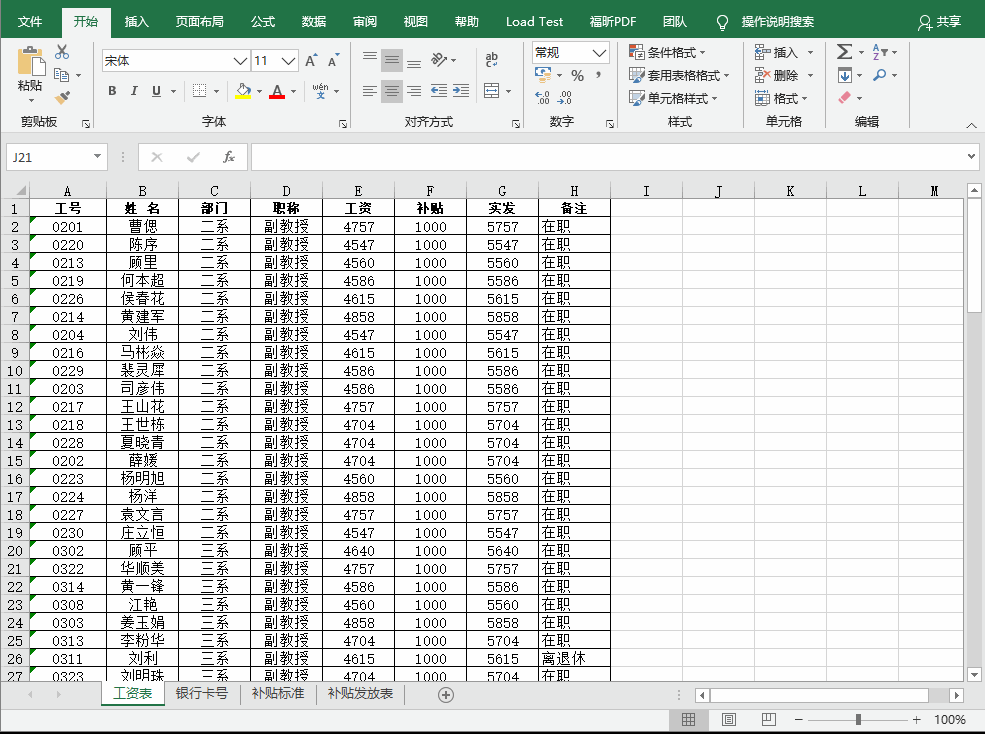
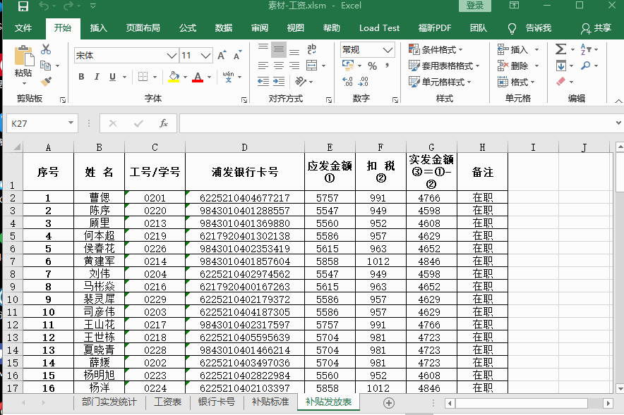
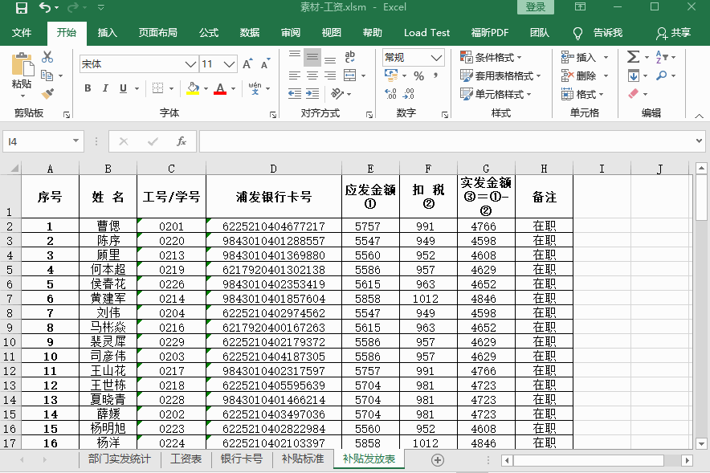

# 实验2第2题-工资

## 使用知识介绍

EXCEL中进阶重点为四大函数、数据透视图、宏命令，四大分别是**IF函数**、**VLOOKUP函数**、**SUMIF函数**、**COUNTIF函数**。掌握了他们基本可以搞定EXCEL中90%的问题，此次实验使用了**IF函数、VLOOKUP函数、宏命令**。

## 实验素材

- 实验素材下载链接：

 

## 实验题目

- 实验题目下载链接：

 

## 实验参考

### 题目1：计算应发补贴金额

`根据工作表“工资表”的数据，在工作表“补贴发放表”E列中，利用VLOOKUP函数，计算应发补贴金额`

- 在打开文档时会询问是否启用宏，在此我们需要**启用宏内容**。


- 使用**VLOOKUP函数**计算应发补贴金额示例。



### 题目2：计算扣税额

`在工作表“补贴发放表”的F列，利用公式计算扣税额（离退休人员免税；应发金额小于等于800元免税，大于800元扣税额=（应发金额-800）*0.2）`

- 使用嵌套**IF函数**计算扣税额。



- 使用嵌套函数计算扣税额示例。



### 题目3：计算实发金额

`在工作表“补贴发放表”的G列，利用公式计算实发金额（实发金额=应发金额-扣税）`

- 计算实发金额示例。



### 题目4：数据透视表

`根据工作表“工资表”的数据，参考样图，利用数据透视功能，统计每个部门不同职称实发平均值，带2位小数显示，并将生成的新工作表命名为“部门实发统计”`

- 使用**数据透视表**示例。



### 题目5：补全宏命令

`在模块1的“批注()”中，完成代码实现查找因离退休而扣税为0的单元格，并插入批注："VBA:" & Chr(10) & "离退休免税！"（可用录制宏功能，获得所需代码）`

1. 找到宏命令并**查看**并**编辑**。

   

3. 完整的宏命令格式如下：

```vb
Sub 批注()

 Sheets("补贴发放表").Select
 For i = 2 To 106                                          '第2---106行为有效记录
   If Cells(i, 6) = 0 And Cells(i, 8) = "离退休" Then
       Range("F" & i).Select
       Range("F" & i).AddComment
       Range("F" & i).Comment.Visible = False
       Range("F" & i).Comment.Text Text:="VBA:" & Chr(10) & "离退休免税！"  '此处加代码

   End If
 
 Next
End Sub

```

- 补全宏示例：



### 题目6：执行宏

`执行“批注()”过程，插入批注`

- 执行宏示例。



