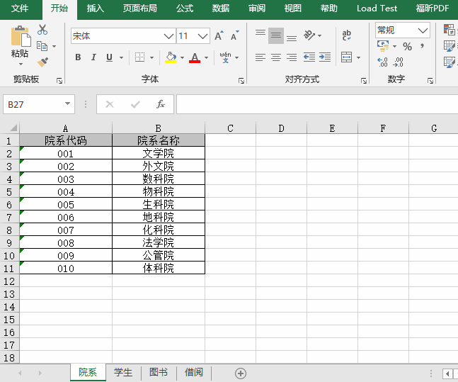
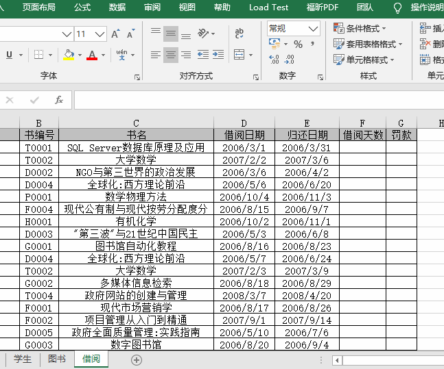
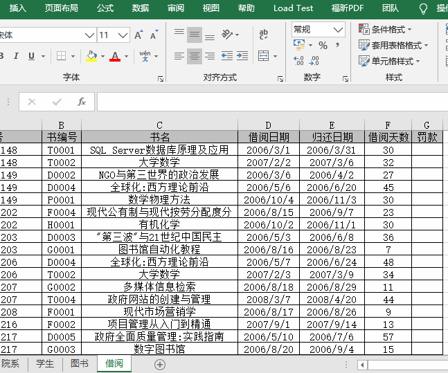
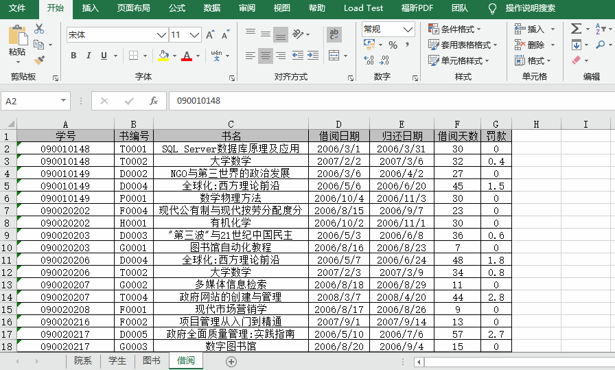
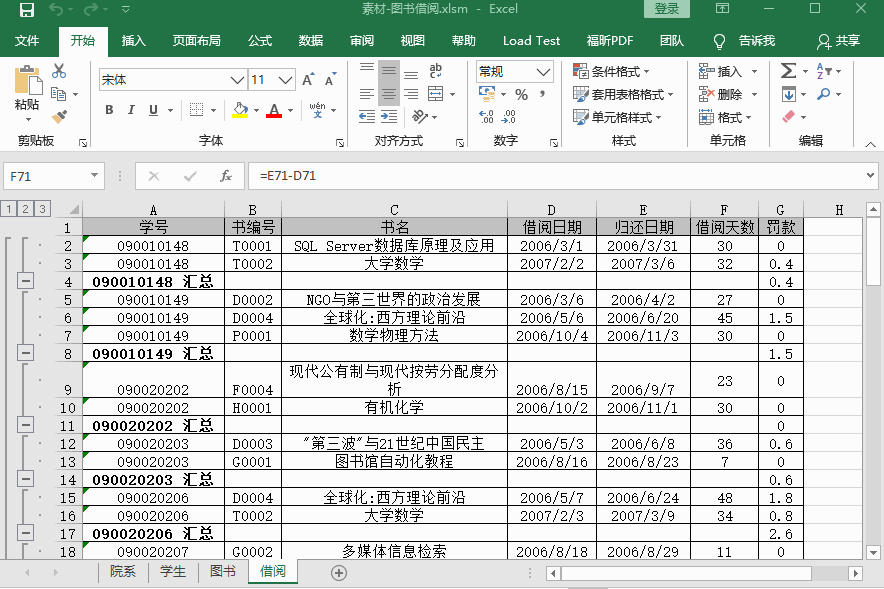
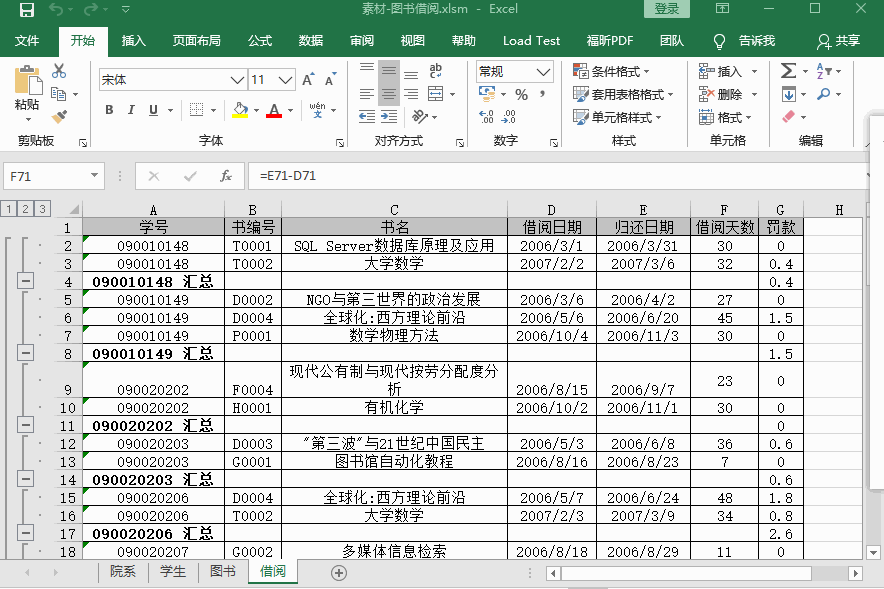

# 实验2第3题-图书借阅

## 使用知识介绍

EXCEL中进阶重点为四大函数、数据透视图、宏命令，四大分别是**IF函数**、**VLOOKUP函数**、**SUMIF函数**、**COUNTIF函数**。掌握了他们基本可以搞定EXCEL中90%的问题，此次实验使用了**IF函数、VLOOKUP函数、宏命令**。

## 实验素材

- 实验素材下载链接：

 

## 实验题目

实验题目下载链接：

 

## 实验参考

### 题目1：填写对应书名

`根据工作表“图书”数据，在工作表“借阅”C列中，利用VLOOKUP函数，填写对应的书名`

- 在打开文档时会询问是否启用宏，在此我们需要**启用宏内容**。


- 使用**VLOOKUP函数**填写对应书名示例。



### 题目2：计算借阅天数

`在工作表“借阅”F列中，利用公式计算借阅天数（借阅天数=归还日期-借阅日期）`

- 计算借阅天数示例。



### 题目3：计算罚款

`在工作表“借阅”G列中，利用公式计算罚款（借阅天数超过30天罚款：书编号首字符为“T”，每超1天罚款0.2元；其它图书每超1天罚款0.1元）`

- 使用**嵌套IF函数**计算罚款金额示例。



### 题目4：计算分类汇总

`在工作表“借阅”中，按学号分类汇总，统计每位学生罚款总额`

- 计算分类汇总示例。



### 题目5：补全宏

`在模块1的“标注()”中，完成代码实现设置罚款超过2元的借阅记录（不包括汇总行）为红色斜体字（可用录制宏功能，获得所需代码）`

1. 找到宏命令并查看。

   

2. 完整的宏命令格式如下：

```vb
Sub 标注()
 Sheet4.Activate
 For i = 2 To 84                                      '第2---84行为借阅记录
   If Cells(i, 7) >= 2 And Cells(i, 6) <> "" Then
       
    Range("A" & i & ":" & "G" & i).Select
    
    With Selection.Font
      .Color = -16776961                                              '此处增加代码
      .Italic = True
    End With
       
    
   End If
 Next
End Sub
```

- 补全宏示例：



### 题目6：执行宏

`执行“标注()”过程`

- 执行宏示例。

