---
title：测试

---
# 安装HEXO
## 安装Node.js
- 安装hexo
- 安装hexo之前，需要安装Node.js和Git
- 下载Node.js及安装,访问Node.js官网，按下列步骤下载Node.js
- Nodejs官网下载地址
```
https://nodejs.org/zh-cn/download/
```
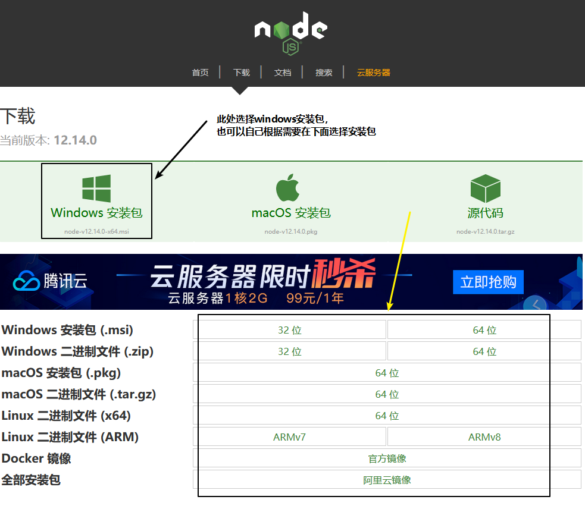

- 安装Node.js


- 安装完成后使用下列命令查看nodejs的版本
```
node -v
```
<!--more-->
- 版本信息截图如下</br>
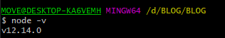

## 安装Git
- 下载Git及安装
- 访问Git for Windows官网下载git，下载完后一直下一步安装即可
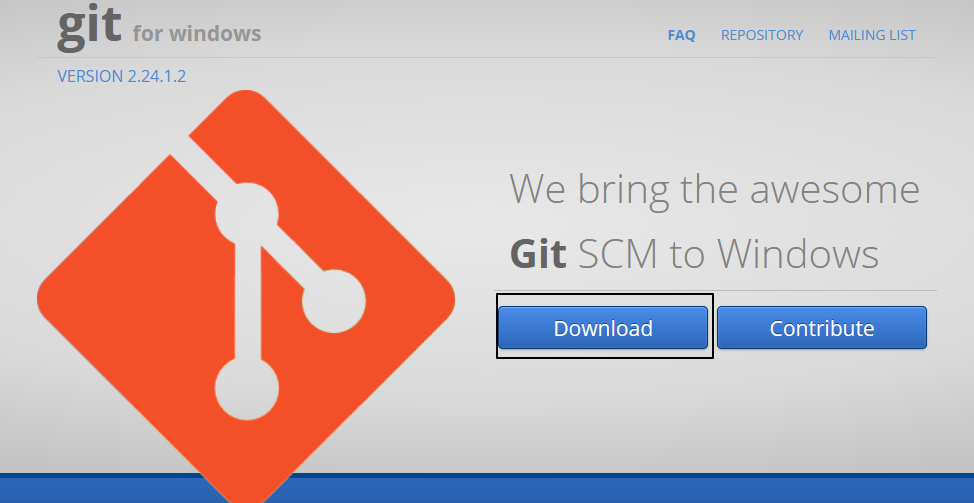

## 安装Hexo
- 安装hexo
- 首先我们创建一个用于存放博客的文件夹，文件夹名称随意，本文此处叫BLOG文件夹
- 打开此文件夹，在文件夹内右键，选择打开git bash
- 使用下列命令安装hexo，等待完成
```
npm install -g hexo
```
- 因为hexo的源在国外，所以安装hexo 是一个漫长的过程，我们就慢慢等待吧
- 我们也可以使用国内源淘宝的源来安装，使用淘宝源之前需要安装淘宝源的插件
- 安装插件成功后使用下面的代码安装hexo
```
cnpm install -g hexo
```
- 安装hexo成功的截图
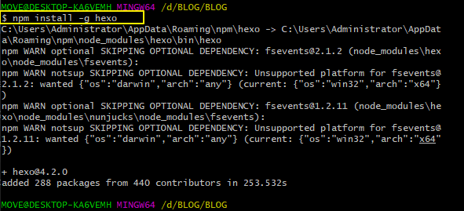
- 使用下列命令查看hexo版本信息
```
hexo -v
```
- 版本信息截图如下，注意，如果版本在3.0以上，在使用图片插件`hexo-asset-image`时会有bug，需要按照下面的文章内容做修改
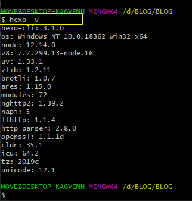

- hexo初始化，此处指的是在hexo nignx node.js已经安装好的情况下，也就是整个hexo的环境都安装好的情况下
- 在你想要创建博客的文件夹下使用如下命令创建博客，注意，此文件夹必须为空
```
hexo init
```
- hexo 初始化成功的截图如下
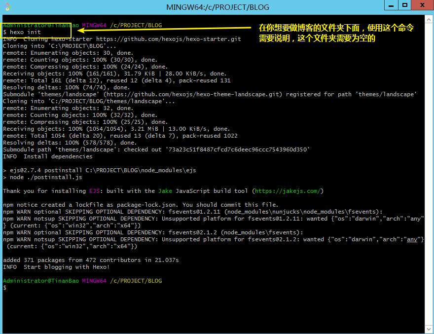

- 因为初始化是从国外网站下载文件，如果使用以上命令初始化不成功，那说明要么你的网络太卡，要么你的网络被过滤了，此时有两种方法
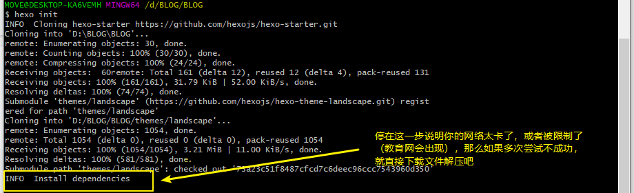

- 1.如果你拥有代理可以科学上网，那么使用如下命令切换一下你的代理(将 `127.0.0.1：8888`换为自己的代理地址)
```
npm config set proxy http://127.0.0.1:8888
npm config set https-proxy http://127.0.0.1:8888
```
- 2.如果不可以科学上网，那么直接下载文件将其解压到文件夹下即可，文件下载地址如下


- 使用hexo init命令成功后，文件目录如下
  
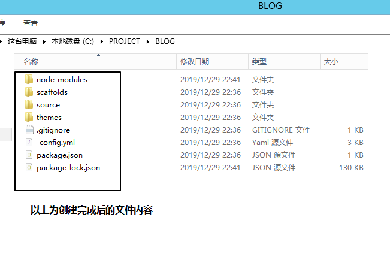

- 在git Bash中，使用如下命令启动hexo，代表着hexo的使用已经初步成功了
```
hexo server
```
- 也可以简化为
```
hexo s
```
- 启动截图如下
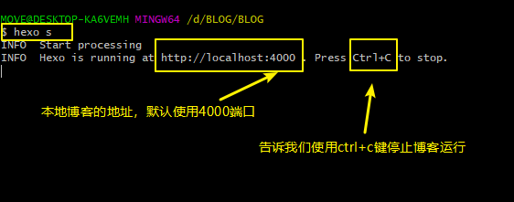

- 启动成功后，根据信息，在浏览器输入 `http://localhost:4000` 查看效果，如果出现以下内容，说明你已经成功了
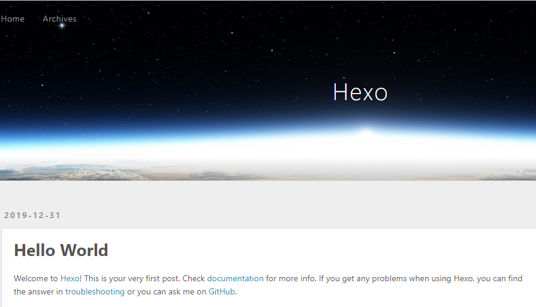

- 创建文章并发布
- Hexo 博客可以根据Markdown根式文件自动生成静态网页，我们只需要编写Markdown文件就额可以了
- 我们可以使用以下命令创建一个Markdown文件，或者自己创建一个Markdown文件
```
hexo new "文章名称"
```
- 其中 文章名称 换成自己的文章名称就可以了，创建文章指令完成后，会在博客文件夹下的`source->_posts`文件夹生成一个.md文件
- 创建文章示例
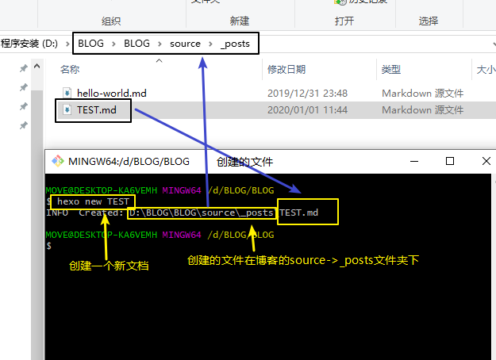

- 打开文章编辑一下
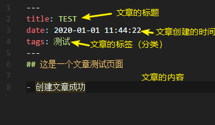

- 文章编写完成后，在`git bash`中使用下列命令将文章发布到自己的网站上
```
hexo generate
```
- 命令也可以简写为
```
hexo g
```
- 查看结果
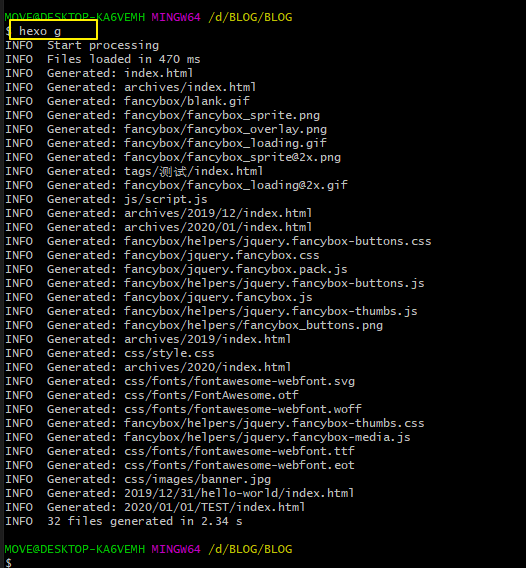

- 在`git bash`中使用`hexo s`启动网站，在浏览器中输入对应的地址查看效果
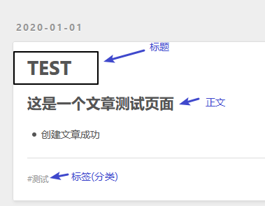

# 更改NEXT主题

- 百度搜索next，选择next主题
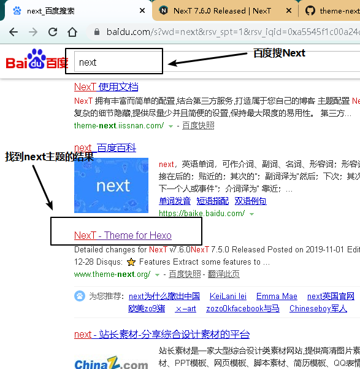

- 找到next的git图标，打开next的git地址
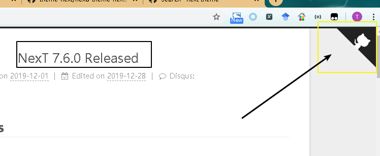

- 下载github上next的zip文件
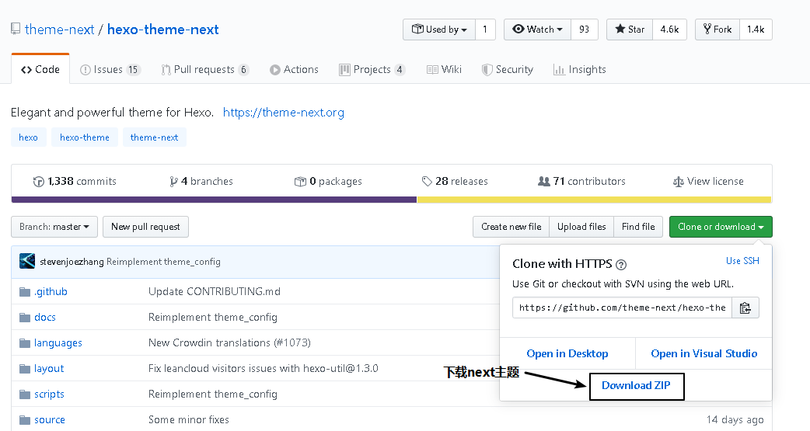

- 找到博客文件夹下的themes文件夹，此文件夹存放博客的主题文件，目前文件夹已有一个默认的主题文件
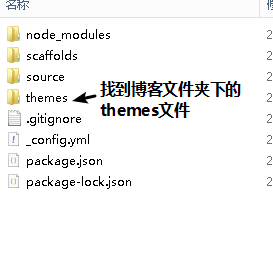

- 将下载的文件更改名称，名称更改不做要求，但要说明的是，此处的文件夹名称在配置文件中需要配置
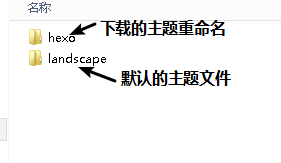

- 修改博客配置文件，博客配置文件在博客文件夹根目录下，注意此处的博客配置文件和主题配置文件要区分开
- 博客配置文件</br>
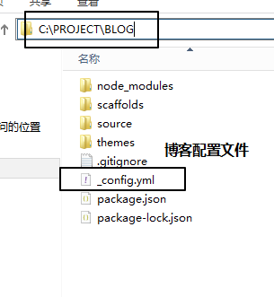
- 主题配置文件
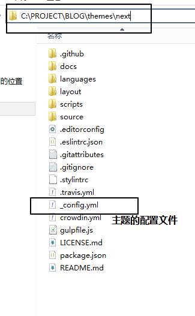

-修改博客配置文件(注意此处是博客配置文件)，将博客配置文件的主题更改为next主题，也就是我们刚刚下载的主题

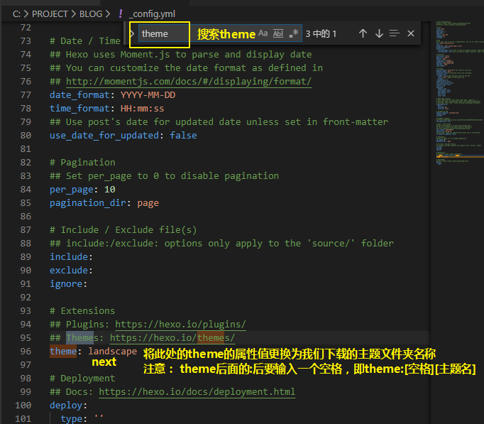

- 修改博客的语言，注意此时需要查看主题文件夹下的language文件夹里面的文件，找到想要设置的语言，记住文件名称，然后修改博客配置文件（注意此处是博客配置文件）中的语言，修改为相应的文件名称
- 主题文件夹下language文件夹内语言文件
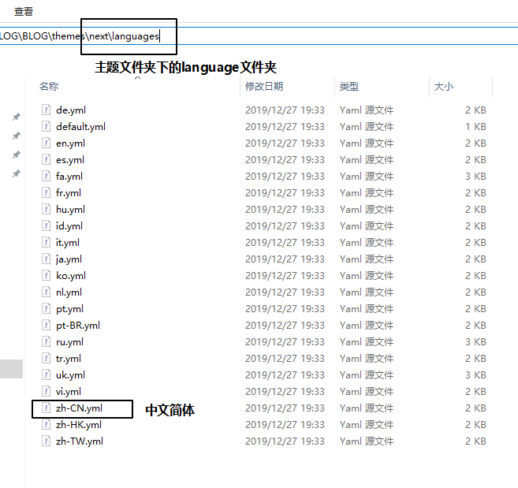

- 修改博客配置文件的语言
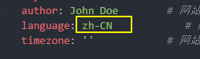

## 配合nginx使用
- 配合nginx使用
- 使用hexo的命令 `hexo server` 来运行网站效率不是特别高，而且不能关闭git bash或cmd窗口，推荐使用nginx+hexo的方式
- windows下nginx使用比较简单，首先下载nginx，并将其放到博客文件夹的同级上
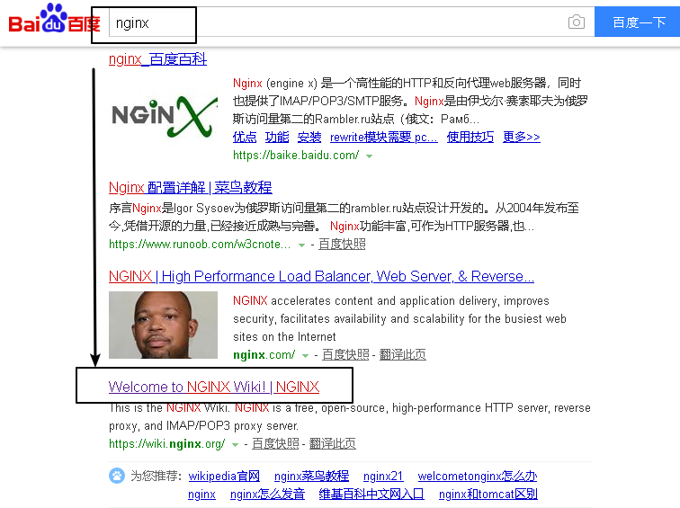
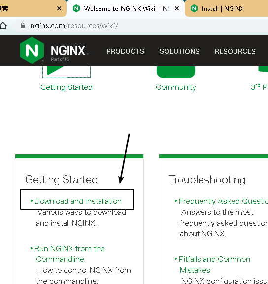
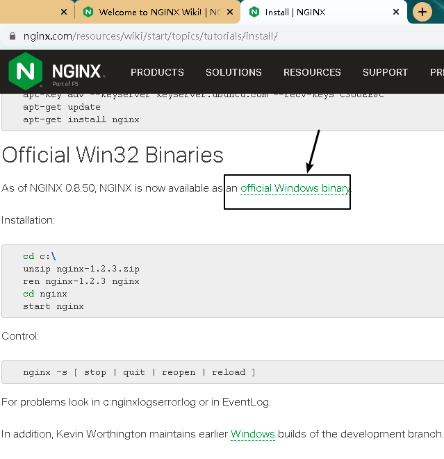
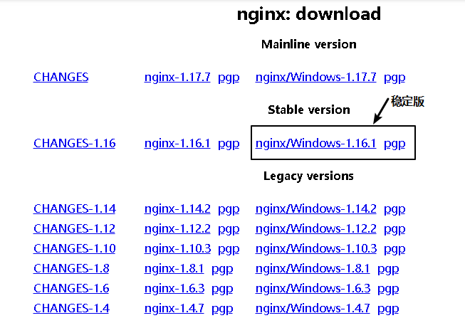
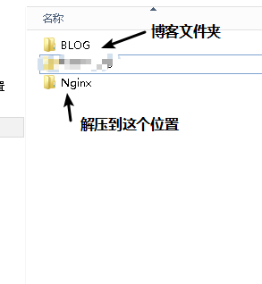

- nginx下载好之后，配置nginx内容，更改nginx网站运行的文件夹
- 找到配置文件
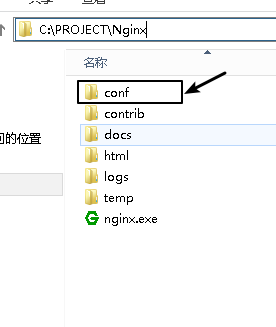
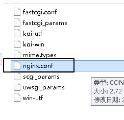
- 修改配置文件中的端口号及网站所在文件夹，端口号随意，此处使用80端口号是因为80端口是默认端口，在浏览时不需要再输入端口号
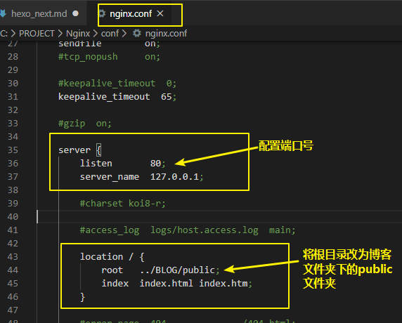
- 配置完成后，运行nginx应用程序即可
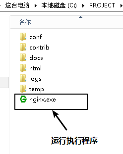


## 发布带有图片的博客
- 博客文章中带有图片，怎么将图片post(使用hexo g时自动添加图片链接提交图片)出去
- 首先我们要安装图片发布的插件，如果觉得使用国外的源安装插件速度太慢，我们可以使用过内的插件源安装插件，首先安装国内源插件

- 安装国内源插件

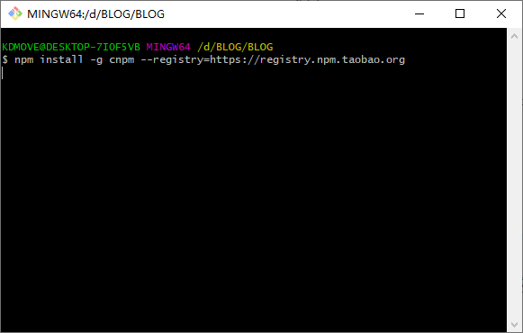

- 安装完成后使用国内源安装图片插
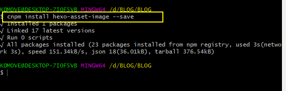

- 此时我们需要查看一下`hexo`的版本，如果版本是在`3.0`以上的话，`hexo`对网站`url`的规则做了一定的更改，导致了`hexo-asset-image`插件出现了问题，此时我们需要修改`hexo-asset-image`插件的`index.js`文件
- 首先在博客目录下找到 `node_modules` 文件夹
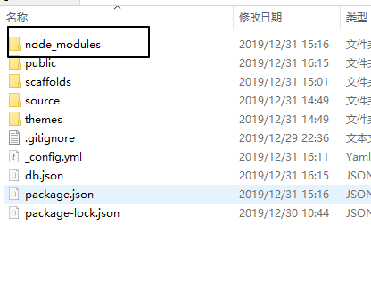

- 找到`hexo-asset-image`文件夹

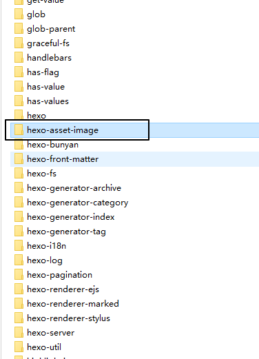

- 找到`index.js`文件并打开

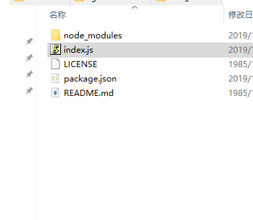

- 删除原本内容，将下面的代码复制进去并保存
 ```
 'use strict';
var cheerio = require('cheerio');
function getPosition(str, m, i) {
  return str.split(m, i).join(m).length;
}
var version = String(hexo.version).split('.');
hexo.extend.filter.register('after_post_render', function(data){
  var config = hexo.config;
  if(config.post_asset_folder){
    	var link = data.permalink;
	if(version.length > 0 && Number(version[0]) == 3)
	   var beginPos = getPosition(link, '/', 1) + 1;
	else
	   var beginPos = getPosition(link, '/', 3) + 1;
	// In hexo 3.1.1, the permalink of "about" page is like ".../about/index.html".
	var endPos = link.lastIndexOf('/') + 1;
    link = link.substring(beginPos, endPos);
    var toprocess = ['excerpt', 'more', 'content'];
    for(var i = 0; i < toprocess.length; i++){
      var key = toprocess[i]; 
      var $ = cheerio.load(data[key], {
        ignoreWhitespace: false,
        xmlMode: false,
        lowerCaseTags: false,
        decodeEntities: false
      });
      $('img').each(function(){
		if ($(this).attr('src')){
			// For windows style path, we replace '\' to '/'.
			var src = $(this).attr('src').replace('\\', '/');
			if(!/http[s]*.*|\/\/.*/.test(src) &&
			   !/^\s*\//.test(src)) {
			  // For "about" page, the first part of "src" can't be removed.
			  // In addition, to support multi-level local directory.
			  var linkArray = link.split('/').filter(function(elem){
				return elem != '';
			  });
			  var srcArray = src.split('/').filter(function(elem){
				return elem != '' && elem != '.';
			  });
			  if(srcArray.length > 1)
				srcArray.shift();
			  src = srcArray.join('/');
			  $(this).attr('src', config.root + link + src);
			  console.info&&console.info("update link as:-->"+config.root + link + src);
			}
		}else{
			console.info&&console.info("no src attr, skipped...");
			console.info&&console.info($(this));
		}
      });
      data[key] = $.html();
    }
  }
});
 ```   
# 博客的配置文件介绍

```
# Hexo Configuration hexo的配置文件
## Docs: https://hexo.io/docs/configuration.html 参考文档地址
## Source: https://github.com/hexojs/hexo/ hexo的地址

# Site 网站的信息
title: Hexo             #网站的标题
subtitle: ''            #网站的副标题
description: ''         #网站的描述信息
keywords:               #网站的关键词，使用英文状态下半角逗号 ','隔开，分隔多个关键词。
author: John Doe        # 网站的作者
language: zh-CN            # 网站所使用的语言
timezone: ''            # 网站的市区，请参考时区列表设置，国内可以使用 Asia/Shanghai。

# URL 网址
## 如果您的网站存放在子目录中，例如 http://yoursite.com/blog，则请将您的 url 设为 http://yoursite.com/blog 并把 root 设为 /blog/。
url: http://yoursite.com  #网址
root: /                   # 网站的根目录，不需要更改，如果是在子目录下，此处请将目录切换为子目录
permalink: :year/:month/:day/:title/  # 网站的永久链接地址，默认格式是年月日，不需要更改
permalink_defaults:     # 永久链接中各部分的默认值，不需要更改
pretty_urls:          #url 美化，有下面两个选项
  trailing_index: true # 是否保留永久链接尾部的index.html，设为false时去除
  trailing_html: true # 是否保留永久链接尾部的.html，设为false时去除，(对尾部的index.html无效)

# Directory 目录，整个网站的文件目录，不需要做更改
source_dir: source             # 资源文件夹，这个文件夹用来存放内容。默认值是source，即博客文件夹下的source文件夹
public_dir: public             # 公共文件夹，这个文件夹用于存放生成的站点文件。默认值是public,即博客文件夹下的public文件夹
tag_dir: tags                  # 标签文件夹,默认值是tags
archive_dir: archives          # 归档文件夹，默认值是archives
category_dir: categories       # 分类文件夹，默认值是categories
code_dir: downloads/code       # Include code 文件夹，source_dir 下的子目录，默认值是downloads/code
i18n_dir: :lang                # 国际化（i18n）文件夹，默认值是:lang，注意有冒号。
skip_render:                   # 跳过指定文件的渲染。匹配到的文件将会被不做改动地复制到 public 目录中。您可使用 glob 表达式来匹配路径。

# Writing
new_post_name: :title.md      # 新文章的名字，默认值 :title.md，注意冒号。
default_layout: post          # 预设布局
titlecase: false              # 把标题转换为 title case
external_link:                # 在新标签中打开链接，有以下三个属性
  enable: true                # 在新标签中打开链接
  field: site                 # 对整个网站（site）生效或仅对文章（post）生效，有site和post两个值
  exclude: ''                 # 需要排除的域名。主域名和子域名如 www 需分别配置
filename_case: 0              # 把文件名称转换为 (1) 小写或 (2) 大写，0不转换
render_drafts: false          # 显示草稿
post_asset_folder: true      # 启动 Asset 文件夹，主要配合图片、音频、视频等使用
relative_link: false          # 把链接改为与根目录的相对位址
future: true                  # 显示未来的文章
highlight:                    # 代码块的设置，有以下的属性
  enable: true                # 开启代码块高亮
  line_number: true           #　显示行号
  auto_detect: false          # 如果未指定语言，则启用自动检测，此处指代码的语言
  tab_replace: ''             # 用 n 个空格替换 tabs；如果值为空，则不会替换 tabs
  wrap: true                  # Wrap the code block in <table>
  hljs: false                 # Use the hljs-* prefix for CSS classes

# Home page setting
# path: Root path for your blogs index page. (default = '')
# per_page: Posts displayed per page. (0 = disable pagination)
# order_by: Posts order. (Order by date descending by default)
index_generator:
  path: ''
  per_page: 10        # ？？每页显示的文章量 (0 = 关闭分页功能)	
  order_by: -date     # 分页原则 -date 表示按日期

# Category & Tag
default_category: uncategorized  # 默认分类
category_map:                    # 分类别名
tag_map:                         # 标签别名

# Metadata elements
## https://developer.mozilla.org/en-US/docs/Web/HTML/Element/meta
meta_generator: true            #　Meta generator 标签。 值为 false 时 Hexo 不会在头部插入该标签

# Date / Time format
## Hexo uses Moment.js to parse and display date
## You can customize the date format as defined in
## http://momentjs.com/docs/#/displaying/format/
date_format: YYYY-MM-DD    # 日期的格式　　　
time_format: HH:mm:ss      # 时间的格式
## Use post's date for updated date unless set in front-matter
use_date_for_updated: false # 

# Pagination
## Set per_page to 0 to disable pagination
per_page: 10            # 每页显示的文章量 (0 = 关闭分页功能)
pagination_dir: page    # 分页目录

# 在 Hexo 配置文件中，通过设置 include/exclude 可以让 Hexo 进行处理或忽略某些目录和文件夹。你可以使用 glob 表达式 对目录和文件进行匹配。
# Include / Exclude file(s)
## include:/exclude: options only apply to the 'source/' folder
include:     # Hexo 默认会忽略隐藏文件和文件夹（包括名称以下划线和 . 开头的文件和文件夹，Hexo 的 _posts 和 _data 等目录除外）。通过设置此字段将使 Hexo 处理他们并将它们复制到 source 目录下。
exclude:     # Hexo 会忽略这些文件和目录
ignore:      # Ignore files/folders

# Extensions
## Plugins: https://hexo.io/plugins/
## Themes: https://hexo.io/themes/
theme: next # 使用的主题，landscape是默认主题，若要换主题，换成主题相应的文件夹即可

# Deployment
## Docs: https://hexo.io/docs/deployment.html
deploy:    # 使用hexo d 提交的地址，此处主要配置git
  type: ''

```

# NEXT主题配置
- 每个主题都有自己的配置文件，此处的配置文件名称与博客的配置文件名称相同，注意要和博客的配置文件区分开
- 主题的配置放在各主题文件夹的根目录下

## 更换网站图标